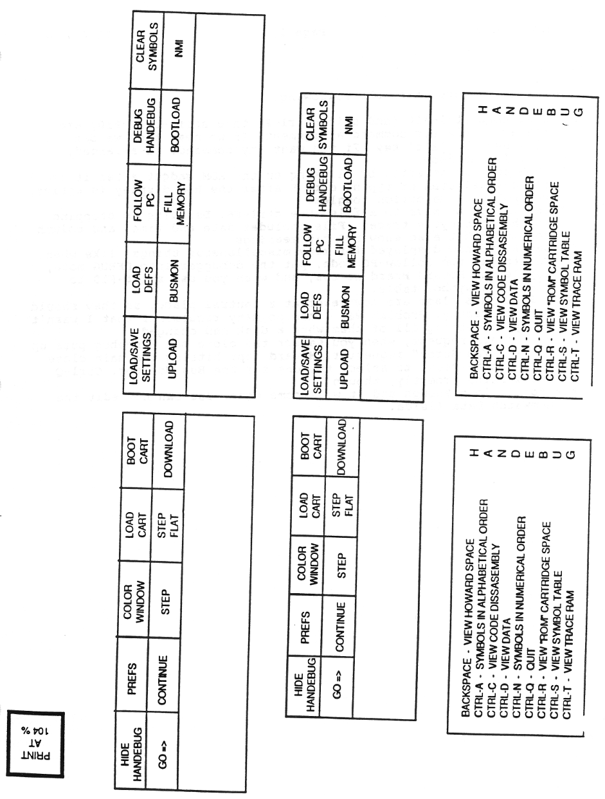

# Handebug Changes

## Changes for Handebug v1.35

- Added labels to disassembly listing
- Disassembly listing will now highlight the current line, based on the current contents of the PC, if that address is on the display.
- Added use of control keys:  
  `CTRL-C`: change display to `CODE`  
  `CTRL-D`: change display to `DATA`  
  `CTRL-S`: change display to `SYMBOLS` (when implemented)  
  `CTRL-T`: change display to `TRACE` (when implemented)  
  `CTRL-Q`: quit, exit, bye-bye.  
  These keys are also supported through the *Handebug*-*Handycraft* interface.

- Use the new `FileIO` requestor which defaults to the current directory, and remembers a specified path.
- Improved `DownLoad` so that, if clearing old symbols, it stops processing the symbol file once all symbols are gone.
- This version will remember your color settings when you hide the *Handebug* screen and restore them when you re-open the display. It won't save them to a file. Yet.
- Enhanced the `Structure Display`/`Editor`:
  - a line starting with a semi-colon is a comment line
  - blank lines are ignored
  - text following required fields are ignored and can be used for comments
  - `SIZE` for a `TYPE TEXT` specifies maximum string length.
  - `POSITION` for `STRUCTURE` specifies window pixel coordinates.
  - `SIZE` for `STRUCTURE` specifies window pixel size. 
  - added 2 new `TYPES`:  
    `TYPE WORD` - 2 bytes hex, high-byte/lo-byte  
    `TYPE DBYTE` - 2 bytes hex, lo-byte/high-byte  
    note that `TYPE HEX` defaults to 1 byte. 2 byte size still is displayed as high-byte/lo-byte.
  - improved the parsing of `handebug.defs` file to allow more free-format style of definition.
  - improved error reporting of parsing `handebug.defs` file, ...  
    error messages go to stdout (CLI window).
  - fixed miscellaneous bugs.
  - `OFFSET` for `STRUCTURE` specifies global offset from starting address for entire structure (in DECIMAL!).
  - `OFFSET` for `FIELD` specifies a new local position (offset) (in DECIMAL!) of the field within the structure, as defined by the structure address and global offset. `FIELDS` without an `OFFSET` param will follow the field prior to it. Questions? Thus, a `FIELD` with a negative `OFFSET` will be BEFORE the effective structure address. Yes, `OFFSET`s can be negative.

```
STRUCTURE NUMBER n
  NAME string
  OFFSET n 
  POSITION x,y 
  SIZE a, b

  FIELD
    OFFSET n 
    POSITION x,y
    TYPE HEX/DEC/BIN/TEXT/POINTER/WORD/DBYTE/STRUCT n
	SIZE 8/16/n
	TITLE 
	  POSITION x,y 
	  TEXT string

; comment
```

e.g., OR

```
STRUCTURE NUMBER 10					STRUCTURE NUMBER 10
  NAME My Sprite Control Block		  NAME My Sprite Control Block 
									  OFFSET -6
  FIELD						
    OFFSET -6						  FIELD
    POSITION 18,2					    POSITION 18,2
    TYPE BIN						    TYPE BIN
    SIZE 16							    SIZE 16
    TITLE							    TITLE
      POSITION 0,2					      POSITION 0,2
      TEXT Some Flags				      TEXT Some Flags
    TITLE							    TITLE
      POSITION 18,3					      POSITION 18,3
      TEXT HXVFGFS					      TEXT HXVFGFS

  FIELD								  FIELD
    OFFSET -4						    POSITION 18,4
    POSITION 18,4					    TYPE HEX
    TYPE WORD 						    SIZE 8
    SIZE 16							    TITLE
    TITLE							      POSITION 0,4
      POSITION 0,4					      TEXT Some Data
      TEXT Some Data				
									  FIELD
  FIELD								    POSITION 18,5
    OFFSET -2						    TYPE STRUCT 19
    POSITION 18,5					    SIZE 16
    TYPE STRUCT 19 					    TITLE
    SIZE 16							      POSITION 0,5
    TITLE							      TEXT Position Data
      POSITION 0,5
      TEXT Position Data
```

> **Note**: `STRUCTURE OFFSET`'s and `FIELD OFFSET`'s may be combined. `STRUCTURE OFFSET` determines the start of the structure, `FIELD OFFSET` determines the start of the field within the structure.

In the first example, the `FIELD OFFSET`'s after the first one are not necessary, and are included for example purposes.

Be aware of screen limitations when defining `POSITION` and `SIZE` for a `STRUCTURE`. A window that does not fit on the screen will probably crash the Amiga. *Handebug* screen is `640`x`200`. *Handycraft* screen is `320`x`200`.

Also: Unfortunately, as of this release, an `OFFSET` of `0` means NO offset, i.e., the same as NOT specifying an `OFFSET`. This will be fixed. In the meantime, careful construction of structures can avoid the need for any `OFFSET`'s of `0`.

## Changes for Handebug v1.37

Bugs:

- `FIELDS` of `TYPE STRUCT n`, where n was certain values, could not be edited.
- Modifying or displaying a structure that did not start at the same address as the display could cause garbage or incorrect values to be displayed in the large `CODE`/`DATA` display.

## Changes for Handebug v1.38

Symbol support  
  `CTRL-S` for symbols  
  `CTRL-A` = Alpha Sort (default)  
  `CTRL-N` = Numeric Sort alpha/numeric toggle will try to keep same symbol on current line

MUCH faster step/step flat (yay! )

`.RUN` directive in `BIN` file will ONLY SET `GO` ADDRESS if `PC` is non-zero (it will still set it the first time)

`Shift-F8` toggles `Follow-PC` mode in the `CODE` display (default is `OFF`)  
Fixed GURU problem with `Download`

Fixed (hopefully) problem with not updating memory referenced by a string pointer in the structure display

> **Hint**: If using symbols, do a `Shift-F9` to clear the current symbol list before downloading a new file. This may help speedup downloading.

## Changes for Handebug v1.39

- Hopefully cleared up all of the known bugs with `SYMBOLS`.
- Fixed bug (GURU) associated with downloading files.
- Fixed bug associated with performing an `RTS` while doing `Single Step` or `Step Flat`.

- The message "`Whoa! Handy wants to update Memwatch!!!`" should, at most, happen once. It shouldn't happen at all, but at least now it shouldn't loop forever!

- When `Bootloading` or `Downloading` from *Handycraft*, *Handebug* will temporarily reset the *Handycraft* screen colors to the `WorkBench` colors to insure that the requestor can be seen.

-If a symbol matches the address in the *GO* field, it is displayed along with the hex value. It (the symbol) is not editable (yet) .

- *MemWatch* is now -mostly- implemented. It will currently accept the standard hex address (symbolic addresses will come later), and will display data in one of three formats. Selecting a format or entering an address activates the `MemWatch` field. Selecting the same format a second time de-activates the field. The data field is NOT editable yet. It is also updated directly from the apple (Handy) so it is true and accurate.

- Made automatic symbol loading optional .... default is `OFF`. So far, there is no way to turn it `ON` (some option!). Make a suggestion.

-If `AutoSymbolLoad` is `OFF`, then:  
 The symbol list is cleared when any file is downloaded. The first time symbols are selected after a download a requestor with the correct values for the last downloaded file appears - hit return to load the symbols.

- When loading new symbols, old symbols with matching names are now deleted regardless of value. This currently won't affect anybody, as symbols are always cleared when downloading a file anyway (in this release).

- Partially fixed problem with editing `CODE` addresses. Still doesn't take into account lines added because of labels, so sometimes you aren't left exactly where you think you should be.

- *Handebug* has the capability of accepting commands from external programs. This release includes a utility program that will download files in either `.BIN` format or as raw data, and that can be used in script files: 

```
Download <file> <mode>` 
where :
  <file> is the name of the data file (relative and absolute path names are OK)
  ‹mode> is the download mode and must be either: 
    BIN [GO] 
  or 
    RAW @xxxx 
	
	where 
	  [] indicates 'optional'. 
	  GO means send GO command (load & go). 
	  'xxxx' is the hex load address.
```

Examples:

`Download myfile.bin BIN`

or

`Download myfile.bin BIN GO`

or

`Download mysound.iff RAW @1000`

The program will first issue an NMI to get the apple's attention, then it will try to download the file. *Handebug* must already be running, and the apple must already be `BootStrapped`.

## Changes for Handebug v1.40

- No bug fixes this time.
- `Select`/`Paste` is now implemented ...

To select an item/field, double click on it with the left (select) mouse button. The value, and associated label if one exists, will appear in the title bar.

To paste a selected item, use the right (menu) mouse button. Note that the window containing the target field must be selected for the paste to work. This is only a hassle if you are pasting between the `Structure Edit` window and the main window, and you aren't using *HeliosMouse*.

An item stays selected until another one is selected. This allows you to paste the same value over and over again if you want.

All fields except disassembly text, structure string text and structure pointer can be selected (double clicking on the structure pointer field changes the `Structure Edit` display address).

All fields except disassembly text, structure string text, `MemWatch Data`, `Symbol` values, and `Symbol` text will accept a paste operation. It shouldn't hurt to try, it just won't do anything.

Later, when we have symbolic expression evaluation incorporated, you will be able to select instruction operand fields.

## Changes for Handebug v1.43

Symbols will load somewhat faster. In general, that means that for large symbol files the loading will take about 1/2 the time it used to. This means if symbols used to take 3 minutes to load, they will still take a minute and a half. This is still way too long, but it's a start.

In the *Yet-Another-Bug* department,

Thanks to Larry, a potential visit to the GURU has been located and eliminated. If you had breakpoints specified and downloaded a new version while the *Handebug* screen was closed, the breakpoints remained active (..if you were lucky. If you weren't, ... poof !).

Also, if you used the `+`/`-` keys to modify structure fields they tended to be reset to zero first. This one has now been nipped, also thanks to Larry.

In the *Finally Implemented* department,

Guess what? You can now upload data, now that the feature is not critically needed. The upload requestor also allows you to specify formatted or unformatted, binary or ASCII, and starting and ending addresses. The formatted files are in the form of assembler `.BIN` or source files, respectively.

`Upload Binary` means the data is read and written a byte at a time without conversion. If formatted, the appropriate `ORG` and `DATA` control bytes and lengths and checksums are added to the file. ASCII upload means the data is written as an ASCII representation of the binary data. Each byte is converted to 2 ASCII characters in the range `0`-`9`, `A`-`F`. If formatted, the file looks like an assembler source file with a `.ORG` directive at the top and each line consisting of a `.HS` hex string of 16 bytes followed by a comment field containing the characters represented by the data (if printable) . Yes, it works with the assembler .... I tried it. With unformatted ASCII each line consists only of 2 characters per byte, separated by a space. What this means is that if you have a character string in your program that you want to upload you DON'T use ASCII, you use `Binary` because you want it exactly as it appears. On the other hand, if you have a table of binary values that you want to edit and reassemble, you upload it as ASCII because you want to convert the binary data into something you can edit and assemble. If you just want to save your program as something you can restore later, upload as formatted binary.

In the same category, the download requestor now lets you specify formatted or unformatted, the starting address, whether or not to reset the symbol table, and whether or not you want to issue a `GO` command immediately after downloading. Note that the starting address will be overridden by a `.ORG` directive in a formatted binary file. Sorry, you can only download binary files.

Be aware that selecting the option that does NOT reset the symbol table will cause the symbols to be automatically loaded as soon as the file has been downloaded. This is necessary to prevent old labels with wrong addresses from hanging around.

Also, all these options are "sticky". That is, whatever you select will still be there the next time you want to do an upload or download. For `Download` & `GO` this is cool, because if you select it to begin with then to restart from scratch you just select F5 and hit `<return>`.

Finally, if you get a a requestor that say's, "Caught a GURU, do you want a Snapshot?" please select `YES`. This should create a file called `Snapshot.TB` (probably in the directory you were in when *Handebug* was started) that can we use to try to locate the problem. Save that file and a copy of the version of *Handebug* that was running on a disk for me.

## Changes for Handebug v1.44

You asked for it, you got it! Place the mouse inside the `Display` area, press and hold the left mouse button. Now, move the mouse around OUTSIDE the `Display` area. Wheee! Okay, okay, that's enough fun and frivolity! How does it work? I'm glad you asked. ...

Placing the pointer inside the `Display` area and holding the left mouse button down activates scrolling. Scrolling will then occur whenever the pointer is outside of the `Display` area. When the pointer is above or below the `Display` area the display will scroll up or down. Moving the mouse beyond left and right sides of the `Display` area increments/decrements the display address by one, causing the display to roll in the appropriate direction. The rate of scrolling is relative to the pointer's distance from the `Display` area. Since the area to the left of the `Display` is only about one pixel wide, the rate on that side is always the maximum speed. Also, the right mouse button will cause the display to page up or down when the pointer is above or below the `Display` area. Releasing the left mouse button deactivates scrolling.

Occassionally scrolling may pause for a fraction of a second. This happens when a page of memory that hasn't been updated yet is read from the Apple (Handy). Scrolling over these areas a second time will not pause.

Paragraph:
So what else is new? Symbol loading is so fast it's gonna blind you! Loading a 14.5K symbol file with about 900 symbols takes about 5 seconds. Swooosh!

And, if you clear either name field of the `Bootstrap` requestor then `Bootstrap` will skip that portion of the procedure. This is only used with the new Handy ROMs that get the `Bootload` code from the game cartridge. If you are working with this ROM then you need to clear the `Handy:Bootload.bin` filename.

It's a feature enhancement, not a bug fix ..... OK, OK, it's a bug fix. `Upload Binary` should now work correctly for lengths greater than 255 bytes. Honest, would I lie?

## Changes for Handebug v1.45 (includes changes for v1.44)

V1.44: You asked for it, you got it! Place the mouse inside the `Display` area, press and hold the left mouse button. Now, move the mouse around OUTSIDE the `Display` area. Wheee! Okay, okay, that's enough fun and frivolity! How does it work? I'm glad you asked.

Placing the pointer inside the `Display` area and holding the left mouse button down activates scrolling. Scrolling will then occur whenever the pointer is outside of the `Display` area. When the pointer is above or below the `Display` area the display will scroll up or down. Moving the mouse beyond left and right sides of the `Display` area increments/decrements the display address by one, causing the display to roll in the appropriate direction. The rate of scrolling is relative to the pointer's distance from the `Display` area. Since the area to the left of the `Display` is only about one pixel wide, the rate on that side is always the maximum speed. Also, the right mouse button will cause the display to page up or down when the pointer is above or below the `Display` area. Releasing the left mouse button deactivates scrolling.

Occassionally scrolling may pause for a fraction of a second. This happens when a page of memory that hasn't been updated yet is read from the Apple (Handy). Scrolling over these areas a second time will not pause.

So what else is new? Symbol loading is so fast it's gonna blind you! Loading a 14.5K symbol file with about 900 symbols takes about 5 seconds. Swooosh!

And, if you clear either name field of the `Bootstrap` requestor then `Bootstrap` will skip that portion of the procedure. This is only used with the new Handy ROMS that get the `Bootload` code from the game cartridge. If you are working with this ROM then you need to clear the `Handy:Bootload.bin` filename.

It's a feature enhancement, not a bug fix ..... OK, OK, it's a bug fix. `Upload Binary` should now work correctly for lengths greater than 255 bytes. Honest, would I lie?

V1.45: In a last ditch attempt to break everybody's system, this version of *Handebug* will NOT work correctly with earlier versions of the `monitor.bin` and `bootload.bin` files that are used to bootstrap Handy (the Apple). `GO` and `CONTINUE` now do different things in the monitor code, and so *Handebug* now uses different commands for `GO` and `CONTINUE`.

Don't worry. Be happy.

## Changes for Handebug v1.46

Prior to this release the structure editor would not update display fields that had been modified during a `Single Step` operation. This is now fixed, so that *Handebug* will re-read memory being displayed in the structure display after `Single Stepping`.

Also, the structure editor did not handle single-byte `HEX` fields correctly. This was most apparent when using the `+`/`-` keys to modify the values. It works correctly now, guaranteed.

C Caught a GURU! Thanks to Steve L. another insipid GURU has been stamped out. Previously, if you BootStrapped Handy and then immediately re-loaded symbols, ... Poof !

New features! We can't have a release without new features! Now you can select (double-click) the operand field of a disassembled instruction and the select value will be the result of evaluating the operand expression (e.g., `(table+2),y` ). Note that if a register is part of the expression the contents of the register at the time the expression is selected will be used in the calculation.

## Changes for Handebug v1.47

The major feature addition to *Handebug* for this release is the ability to save and restore the current configuration. immediately after loading *Handebug* looks in `HANDY:` for a file called `Handebug.config`. It will process this file to establish colors, the default path for `.bin`, `.sym`, and other `.config` files, and other things. The current configuration can be saved at any time and reloaded later. Curently supported settings are:

HOME path specification

```
BINFILE filename 
SYMFILE filename 
COLORS 0rgb 0rgb 0rgb 0rgb 
FOLLOWPC ON/OFF 
HIDEWINDOW xx/yy/width/height 
SCREENISHIDDEN 
DISKNAME VOLUME/DEVICE

BREAKPOINT n $xxxx ON/OFF/CLEAR 	Breakpoints
MEMWATCH n $xxxx 8/8x2/16/OFF 		MemWatch fields
GO $xxxx 							Last GO address
REGISTER X
REGISTER Y xx
REGISTER A xx						Register values 
REGISTER PC xxxx					PC should default to 0000
REGISTER P xx
REGISTER ; xx
```

`Shift-F6` can be used to load or save configurations. When saving a configuration *Handebug* will save the current download directory as the `HOME` directory, the screen colors, the state of `FOLLOWPC`, the last size and position of the `Bring-Handebug-Back` window, and whether you refer to disks by volume name or device. It will also save the state of every `MemWatch` field and `Breakpoint` field, and the current register contents.

If a `GO` address has been specified it will also save that. And if a file has been specified for downloading or symbols they will also be saved. If the screen is hidden that will also be written to the file.

`GO`, `BREAKPOINT`, and `MEMWATCH` addresses are symbolic, and can either be hex addresses or labels. If they are labels then a `SYMFILE` must be specified before them. When saving these values *Handebug* will check for a matching label and if found will use that instead.

By specifying addresses of `$0000`, and `CLEAR` for `BREAKPOINTS` and `OFF` for `MEMWATCH` fields you can reset *Handebug* (not stated very clearly, no?)

Just to keep people on their toes I moved things around. Downloading a file now NEVER loads symbols. `RESET SYMBOLS` and `SAVE SYMBOLS` do just what they say. `Shift-F9` now does nothing. The `??` command gadget has been changed to `LoadSymbols`, and function key `F7` has been assigned as the corresponding keyboard equivilant. Also, `Shift-F7` now clears the symbol table. `F7` was used because it was the only one unused. It may be less confusing in the end to re-arrange the function keys to correspond to the order of the command gadgets, but if we did that now we wouldn't have anything to confuse people with later.

Also, *Handebug* now looks in `HANDY:` instead of `S:` for the `Handebug.defs` and `Handebug.config` files. Note, however, that `.config` files loaded via `F6` can exist anywhere.

This is probably the last feature-release for a while. There will continue to be bug fixes as time allows, but feature enhancement requests will be noted and added to the list for later.

## Changes for Handebug v1.48

This version of *Handebug* introduces structure definitions that can be reloaded. `Shift-F7` brings up a file requestor that allows you to specify a new `.defs` file to read structure definitions from. If a file is selected then the previous definitions are discarded and new ones are loaded. The structure window is closed if it is open when the new definitions are loaded.

Also, if a window has a size specification and it doesn't specify `X` and `Y` coordinates, the window will open up in the upper left corner. So, if you don't like that then specify `x`,`y` coordinates for your window.

A few bugs related to windows wrapping around the sides of the display have also been fixed.

## Changes for Handebug v1.59

The `.config` file supports the `romfile` and `rom size` settings. Too bad the current download protocol doesn't support rom size and port ...

When breakpoints are disabled via loading a `.config` file they are now really disabled.

All breakpoints are disabled (but not cleared) when ROM is downloaded.

The default path for symbols is set when you download a `.bin` or `.rom` file, not when you select symbols. This means the default symbol file will always reflect what you've downloaded, not what was in the `Download File` requestor.

The wait-for-handy loop in `CartGo` is longer ... about 10 secs.

## Changes for Handebug v1.64

This version(s) incorporates the following:

`ctrl-F1` thru `ctrl-F10` (and `shift-ctrl-F1` thru `shift-ctrl-F10`) are now available for command assignment. If we need them we can also use the `alt` key. If you want any commands re-arranged, just let me know.

The ROM port is selected by clicking on the `ROM` gadget after it is already selected or typing `ctrl-R` after the `ROM` display is active, the ROM port selection toggles.

Trace Ram can be save to a file. Use `ctrl-F6`. Defaults to stopping at the last cycle traced. File includes date and time, and column headings that also show `BUS` bit meanings.

Messages are now displayed for many miscellaneous things, like when you toggle the `Follow-PC` mode, put the debugger into `DEBUG` mode, toggle the Howard Board access, and when you use `shift-F10` to clear the symbol table.

`GOOD FILENAMES` flags are now reset at a central place, so they should work correctly. Problem was I had so many requesters that I wasn't always resetting all of them when a disk had changed.

As per `Howard-request`, when you select the close box *Handebug* puts up an `Are You Sure?` requester. Howard kept hitting the main close box when he meant to select the one for the Bus Monitor. `Ctrl-Q` still exits promptly, though.

Ask for it long enough and it will come true. You can now edit the `MemWatch Data` fields.

