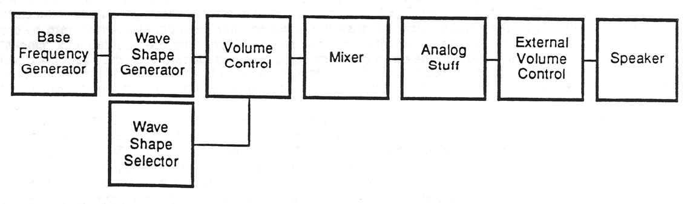
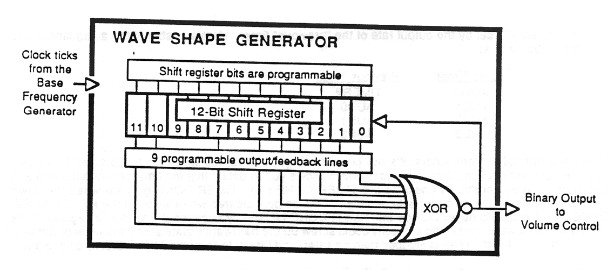
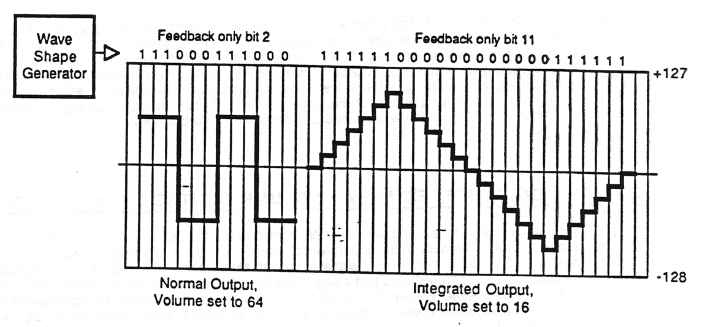
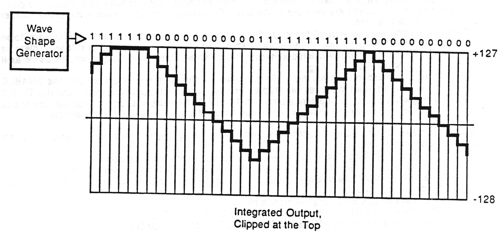

# Handy audio hardware overview

INCLUDE EXAMPLES someday real soon now.

This chapter describes (to a certain extent) the features and functionality of the Handy audio hardware. It presents an overview of the steps required to create Handy audio, starting from the generation of the audio's base frequency clock and following the flow of information all the way out to the Handy speaker.

This information of this chapter is geared toward the sound creator and the audio system programmer; emphasis is placed on the areas that are affected by design and programming choices, while features that are strictly hardware and are not modifiable, such as the digital to analog conversion circuitry, are described only briefly.

Some of the descriptions in this chapter are intended for novice sound programmers; the patience of advanced programmers is requested during these passages.

## Introduction to audio and the Handy audio system

Sound, very briefly, is a compression wave that travels through air. To create this compression wave in Handy, a speaker cone is pushed and pulled from a zero position. The movement of the cone is driven by an electrical signal that varies from a negative to a positive value. The strength of the electrical signal (the amount the cone is displaced from the zero position) is called the amplitude. The period of time that it takes for the signal to go from zero to full positive to full negative and back to zero again is called the frequency.

The Handy programmer can adjust both the amplitude and frequency of the sounds being created. Also, the programmer can cause the wave shape to be relatively steady or wildly erratic. Steady amplitude and frequency creates a steady tone, like a musical note. Crazy amplitude and frequency changes create crazy sounds like explosions.

The following paragraphs give an overview of the Handy audio components and the flow of information through them. More detailed descriptions of the operation of these components can be found in the sections below.

The Handy audio programmer has 4 audio channels at his or her disposal. Throughout most of the description below we'll be looking at sound creation using just one of those channels, but bear in mind that these procedures can be performed on any of the audio channels.

Now, to create a sound.  
The first step is to generate the 'base frequency' of the sound by programming the Base Frequency Generator. The base frequency can range from 60 to 1 million pulses per second. The Base Frequency Generator sends clock pulses at the selected rate to the Wave Shape Generator. The Wave Shape Generator uses a strange algorithm under program control to decide whether to send out a zero or a one. This strange and mystical algorithm, when properly tickled, produces sounds that vary from musical notes to "white noise" sounds like explosions or engine roars. The zeros and ones come out of the Wave Shape Generator at the base frequency rate and go to the Volume Control module, which converts them into signed 8-bit values taking integration into account, and sends the values to the Mixer. The Mixer takes this information, blends in the information from the other audio channels, and creates a single digital audio signal. The rest is all hardware. The digital signal goes to the Analog Stuff component, where the digital signal is converted into an analog signal. The analog signal then passes through the External Volume Control for human adjustment, and from there finally makes it to the speaker.

And that's it. Pretty simple, except for the weird Wave Shape Generator algorithm which is described below (well, at least an attempt is made to do so).

## Base Frequency Generator

The audio starts with the generation of the sound's base frequency. The base frequency is used to create the actual frequency of the sound (high frequency makes high-pitched sounds, low frequency makes deep sounds). Handy audio's base frequency can be used to generate tones with frequencies as high as 1/2 million beats per second (above hearing) and as low as 30 beats per second (almost below hearing). The Handy audio base frequency is created by the Base Frequency Generator, which consists of two parts: the clock selector and the down counter.

With the clock selector the programmer is able to specify the frequency of clock ticks that will be sent to the down counter. The clock selector is made up of two parts: a hardware timer and the bits used to select the timer's frequency. The normal frequencies are: 1 µsec, 2 µsec, 4 µsec, 8 µsec, 16 µsec, 32 µsec, and 64 µsec (where "µsec" stands for microsecond). There is an 8th frequency selection: previous. When previous is selected, the output from another timer (this timer's "previous" timer) is used as the input to this timer. This process is described in more detail a few paragraphs below.

The clock selection causes the timer to periodically wake up and send a pulse to the down counter. This means that if the clock selector is set to, say, 2 microseconds, then every 2 microseconds a pulse will be sent to the down counter (500,000 pulses per second). If the clock selector is set to 1 microsecond, then every microsecond a pulse will be sent to the down counter (1,000,000 pulses per second). This clock with its selectable frequency is known in the paragraphs below as the source clock.

The down counter, which gets its ticks from the source clock, is programmable too. You set the down counter with a value that can range from `0` to `255`. The down counter acts as an integer divider of the clock frequency generated by the source clock, because the down counter must count down to zero before the pulse generated by the source clock will be passed along. Every time the source clock "clocks" (sends a pulse to) the down counter, the down counter's value is tested for zero and when zero the down counter finally causes the Base Frequency Generator to send a clock tick to the next component of the audio system, the Wave Shape Generator. If not zero, the counter is decremented and tested again next time.

If the down counter is set to a value of 0 then every tick from the source clock is passed directly out of the Base Frequency Generator. However, if the down counter is set to `1` then every second tick from the source clock gets sent to the Wave Shape Generator. If the counter is `255`, every 256th tick gets sent. When the down counter is combined with a source clock at a frequency of 1 µsec, any Base Frequency from 1 to 256 µsecs can be created. The 2-µsec clock can be used to create frequencies from 2 to 512 µsecs with an increment of 2 µsecs, et cetera, down to the 64-microsecond source clock being used to create frequencies as long as 16,384 µsecs (16.384 milliseconds), which would result in a very deep sound indeed.

Now that you know how the source clocks work, you can understand selecting "previous" as one of the clock frequency selections. First, if you don't already know, every one of the Handy timers has a so-called previous timer, which is the timer that's processed by the hardware immediately prior to the processing of the current timer. When a timer counts the down counter down to zero and it sends out a pulse, this pulse can be used as the input tick to the timer that's processed next (literally) by the hardware. The "next" timer's frequency is set by the output rate of the "previous" timer. Here's a table of the audio timers and their "previous" timers:

|Audio Timer|Previous Timer|
|---|---|
|AUDO|TIMER7 *|
|AUD1|AUDO|
|AUD2|AUD1|
|AUD3|AUD2|

Unlike the normal system timers, it's not possible to get interrupted when an audio timer times out. However, at least a mechanism is provided which allows you to detect that the timer reached the end and restarted. You detect this by checking the `TIMER DONE` flag. `TIMER DONE` gets set when the down counter counts down to zero and gets reloaded. This bit gets cleared when we write the `RESET TIMER DONE` bit. We should never change the `TIMER DONE` bit directly because the bit is in a register that's shared with hardware, so setting it directly could screw up the hardware's state a bit if the timer is running. On the other hand, if the timer is stopped then it's safer (and faster) to clear the `TIMER DONE` bit directly.

So anyway, if we've got everything right the Base Frequency Generator starts sending periodic pulses down the tube to the rest of this channel's audio hardware. We follow the pulses to their first destination, the mysterious Wave Shape Generator.

## Wave Shape Generator

The Wave Shape Generator is a weird little beastie. It runs at the frequency that's created by the Base Frequency Generator. Every time the Wave Shape Generator receives a pulse, it runs through another iteration of its strange logic to decide whether or not to send a `0` or a `1` to the next component of the audio chain, the Volume Control.

The Wave Shape Generator is comprised of a shift register, a large exclusive-or gate and an inverter. The shift register has 12 bits, each of which can be initialized by the programmer. 9 of the 12 bits (specifically bits `0` to `5`, `7`, `10` and `11`) are used as inputs to the `XOR` gate. Each of these 9 outputs can be individually enabled or disabled. The enabled outputs are exclusive-or'ed together, the result of the `XOR` is inverted, and the resultant value is both the output of this component and the input to the shift register (thereby creating a "feedback" loop).

With each pulse that arrives the Wave Shape Generator creates an output value. Then the contents of the shift register are shifted left, with bit 11 discarded and bit 0 receiving a copy of the output value.

* `TIMER7` refers to the normal system timer channel 7. By the way, the audio timers and the system timers behave identically. System timers have clock selectors and down counters too.

The output that comes from various combinations of inputs and line-enables is strange, and is predictable only by people with brains that are a certain shade of grey. The following hints are provided for the less than fortunate:

- If you enable only bit `0`, then no matter how you've initialized the shift register the output will be a stream of `0 1 0 1 0 1 0 1`. This is the simplest of all waves.
- To expand on the above, if you enable any one of the bits and disable all of the other, you will generate a flip-flopping stream of bits that are correspondingly long. For example, setting only bit `1` will generate `0 0 1 1 0 0 1 1`. Setting only bit `7` will generate `0 0 0 0 0 0 0 0 1 1 1 1 1 1 1 1`. These periodic patterns can be used to make nice symmetric square and triangle waves (as described below).
- More notes ...

## Volume Control and Wave Shape Selector

With each base frequency tick the Wave Shape Generator sends a `0` or a `1` to the Volume Control. The Volume Control converts that binary value into a digital value that can range from `+127` to `-128`, depending both on the state of the Wave Shape Selector's integration bit and on the Volume Control's 8-bit signed volume value.

When in the non-integration mode, the Volume Control output is a simple square wave. The output is the volume value made positive or negative depending on whether the input is `1` or `0` respectively.

On the other hand, when the Wave Shape Selector's integration bit is set the Volume Control's output register is used as an accumulator to create the output value, with the volume value added to or subtracted from the accumulator depending on whether the input to the Volume Control is `1` or `0` respectively. The value is added or subtracted at the clock rate created by the Base Frequency Generator. Because the value is iteratively added and subtracted, the output value can be made to ramp from minimum to maximum and back again. In this way a triangular waveform can be created.

The integration accumulator, you might notice, can float all over the place, and often you won't know where it is at a given instant. The hardware guys assure us that this is OK, that the current value of the accumulator can be ignored because the significance of the Volume Control output is not in the level of the output but in the change of the level. When the output is constant, regardless of the level, no sound will be made. Also, the accumulator clips when it "hits up against the stops" and therefore is constantly justifying itself. As shown in the above illustration, adding a value to an accumulator that's already at the maximum positive value leaves it at the max positive value, rather than causing it to wrap around to a negative value. Subtracting from that accumulator then decreases the output value appropriately. This means that the output wave tends to have the correct shape, although not necessarily centered around zero. See the illustration above for a picture of this logic in action. Note that after clipping, the desired waveform is created indeed although the waveform is offset from the zero position.

## Mixer, Analog stuff, External Volume Control and Speaker

The programmer's ability to affect the audio system ends at the mouth of the mixer. The Mixer accepts the output from each of the four channel's Volume Control components, and, as you might guess, mixes the signals together into a single digital signal. This signal is passed along to the Analog Stuff, which converts the digital signal into analog and then shoots that along to the External Volume Control. There, the user is given final say in the volume level. Finally, the signal makes it to the speaker where the aforementioned compression wave is created, which ripples across the fabric of time-space to beat against the eardrums of all good children. The end.

## Turning a channel on and off

There are two ways to stop an audio timer from running. The first stops the timer immediately, the second lets the timer count down and generate a tick one last time before stopping.

You can stop an audio timer immediately by clearing the timer's `ENABLE COUNT` flag. When the `ENABLE COUNT` bit is set, the down counter counts down as usual. But when the bit is clear, the down counter freezes and no pulses are sent out of the Base Frequency Generator, even if the down counter freezes when its value is zero.

The more elegant way to shut off the audio timer is to have it count to the end of its current down counter setting, send one last pulse, then stop and shut itself off. To shut off a timer this way, clear its `ENABLE RELOAD` flag. After the down counter counts down and the timer shuts down, it's as off as if you'd cleared the `ENABLE COUNT` flag.

Here's a slightly weird truth about the audio hardware: if the timer has timed out and the `ENABLE RELOAD` flag is cleared, then the timer will stop as you would expect, but if you then clear the `TIMER DONE` flag a single timer pulse will be sent after which `TIMER DONE` will be set again. You can use this to drive the source clock directly from software, which can be used to create weird LX audio effects.

If the channel is already on, you may want to turn it off before setting it up to make a new sound. To turn a channel on, you need to initialize:

- The Base Frequency Generator's frequency selection and down counter
- The Wave Shape Generator shift register's 12 bits and the 9 feedback-enable flags
- The Volume Control's volume value and accumulator (also known in hardware land as the "audio output value")
- The Wave Shape Selector's integration bit
- You may want to set and then clear the `RESET TIMER DONE` flag
- You should set both the `ENABLE COUNT` and `ENABLE RELOAD` flags

To turn off a channel:

- You should clear either the `ENABLE COUNT` or `ENABLE RELOAD` flag, depending on whether you want the sound to stop immediately (clear `ENABLE COUNT`) or as soon as it's finished with the current tick (clear `ENABLE RELOAD`)
- Set the Volume Control's volume value and accumulator to zero. Actually, no sound comes out if these aren't set to zero, but setting them to zero helps save battery life a teeny little bit.

However, if you're turning the channel off just long enough to set it to make a new sound, you can skip this step.
