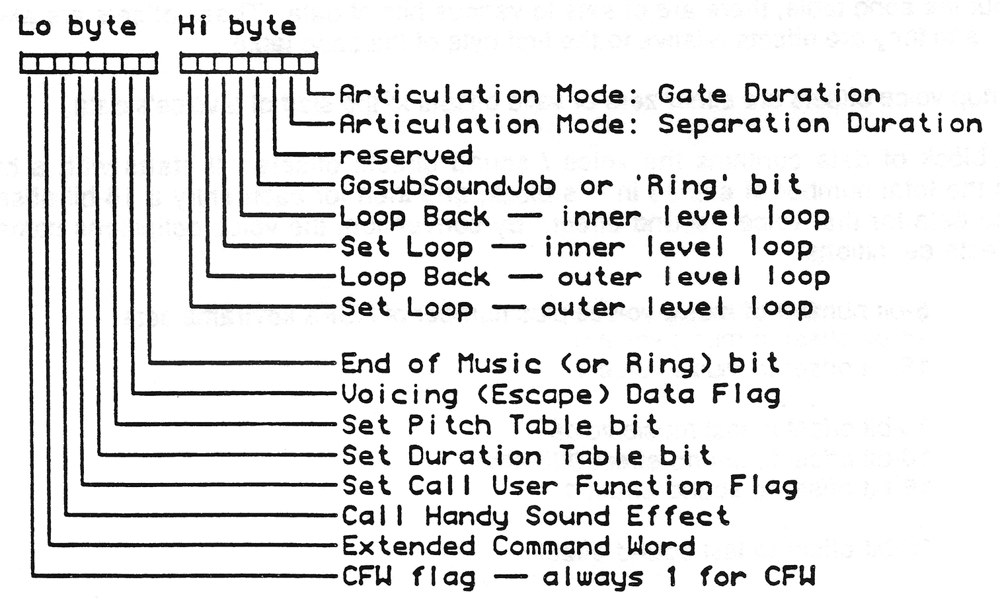
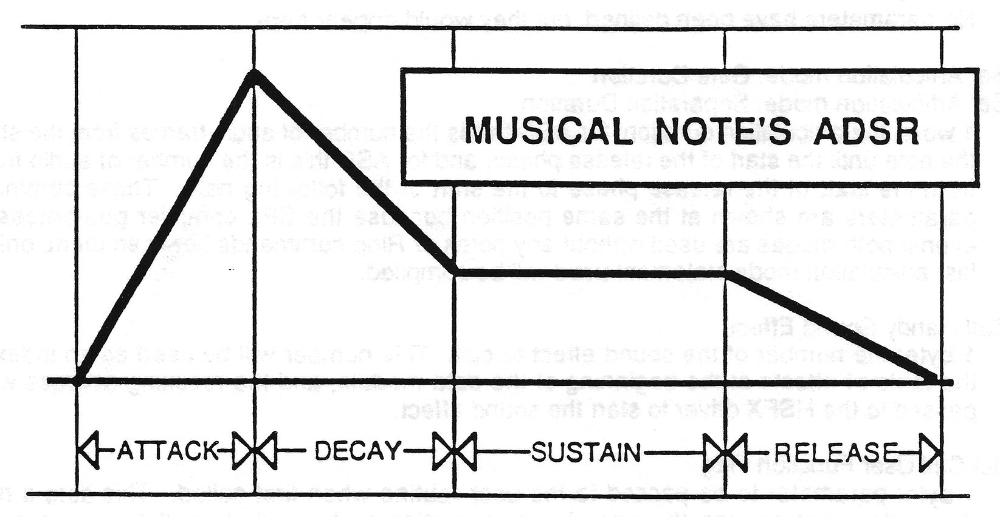

# HMUSIC - the Handy music driver

This chapter describes the steps required to make Handy music. This chapter contains the following sections:

- [Introduction](#introduction)
- [Overview](#overview)
- [*HMUSIC* Commands](#hmusic-commands)
- [Getting Only the Code You Need](#getting-only-the-code-you-need)
- [Voice Instance Numbers](#voice-instance-numbers)
- [User Calls](#user-calls)
- [Priorities of Voices and Sound Effects](#priorities-of-voices-and-sound-effects)
- [Miscellaneous](#miscellaneous)
- [Song Data Table Layout](#song-data-table-layout)
- [Voice Data: Notes and Command Flag Words](#voice-data-notes-and-command-flag-words)
- [Creating `ADSR` Using *HSFX*](#creating-adsr-using-hsfx)
- [Pitch and Data Table Formats](#pitch-and-data-table-formats)

## Introduction

In the beginning there was cave-rock and ug-man. Ug-man played cave-rock.

Here in the future we find that ug-men have evolved into highly-advanced modern electronic musicians. These musicians naturally crave sophisticated software and hardware tools, but, sadly, they find that their tools are still behind in the stone ages. Modern electronic musicians are forced to acknowledge what everyone else already knows: all engineers, without exception, are jerks. Ha ha they laugh like madmen, like crazy monkeys dancing.

## Overview

The *HMUSIC* song system has many strata. At the very top, musicians create songs. These songs, these macadams of melodious merriment, emit forth like diamonds that fall from staves and tumble earthward, plummeting helplessly into the hell-hole of software tools. The software tools subjugate the songs, reducing them to bruised and battered data versions of the ideal; this data then is ready to be "performed" by the *HMUSIC* system code. *HMUSIC* provides commands that allow the programmer to play whole songs or individual voices of a song. Beneath all of this, at the very bottom, is the *HMUSIC* driver's interrupt code which converts each song note into a sound effect and submits the sound effect to the *HSFX* driver. At long last, the *HSFX* driver executes the note!

The normal way for song data to be generated starts with musicians who create the original sound track using some combination of music keyboard and MIDI sequencer. The data generated by the sequencer needs to be translated into *HSPL* (Handy Sound Programming Language) source code. The Handy software system currently provides only one sequencer-to-HSPL translator - `hkcs` - which program translates note data from the Amiga KCS sequencer. Once the song is in *HSPL* source code format, it is further edited by the musician to add voicing parameters, voice priority declaration, and other features supported by *HMUSIC*. When the song source code is ready, it's run through the *HSPL* compiler. The resultant song data then is in a format that can be played by the *HMUSIC* driver.

The layout and contents of the song table data are described is various sections of this chapter. The compiler is described in the chapter [[[HSPL - The Handy Sound Programming Language]]].

A program may contain data for lots of songs, but the *HMUSIC* driver "knows" about only one song at a time. Each song is comprised of one or more voices. Each voice is a stream of individual notes. The *HMUSIC* driver "executes" the data of the song to create each note of each voice.

Each voice of music is assigned its own *HMUSIC* voice channel, if one is currently available. You specify the total number of *HMUSIC* channels by defining the constant `HMUSIC_CHANNELCOUNT`. The default number of channels is 4, which is also the maximum.

Each note played by the *HMUSIC* driver is actually a "sound effect" played by the *HSFX* driver. In order to play the notes of a voice, the *HMUSIC* driver converts the specifics of the note into HSFX keyframes (the basic blocks of data used by the *HSFX* driver to create sound effects). The details of this are described in the [Creating ADSR from HSFX](#creating-adsr-using-hsfx) section of this chapter.

A piece of music can be played using two simple commands, `INITHMUSIC` and then `PLAYMUSIC`. But you aren't constricted to playing whole songs! You can choose instead to add the song to the system, using `ADDMUSIC`, and then play any voice any time you want by calling `STARTVOICE`. Whenever voices are playing, you can stop any voice by using the `STOPVOICE` command. The `STOPMUSIC` command stops all of the voices. All of these commands are described in the [HMUSIC COMMANDS](#hmusic-commands) section of this chapter.

Any of your song's notes can be made to trigger a call to a `USER` subroutine in your code, which provides you with the ability to synchronize music events with game events. This is described in the [USER CALLS](#user-calls) section.

You add the music driver to your code by including 3 files: `6502:include/hmusic.i`, `6502:macros/hmusic.mac` and `6502:src/hmusic.src`.

## HMUSIC Commands

`INITHMUSIC`

`INITHMUSIC` is used to initialize the *HMUSIC* and *HSFX* drivers. You should call `INITHMUSIC` only once, before making any other *HMUSIC* call. Note that when using *HMUSIC* you don't have to use the *HSFX* command `INITHSFX`.

### `PLAYMUSIC`

The `PLAYMUSIC` command plays the specified song.

This routine sets up the song data table's startup voices to play the first 4 voices of the song (which by default are the first 4 "normal" voices of the song), and then executes the `ADDMUSIC` command.

`PLAYMUSIC` returns the values that are normally returned by `ADDMUSIC`.

### `ADDMUSIC`

The `ADDMUSIC` command adds a song's data table to the *HMUSIC* system. Also, if any of the song's 4 startup voice pointers has been initialized to a non-zero value then that voice (or those voices) will start playing.

Note that normally the song data table doesn't specify initial voices to be played. The table is initialized to play voices either by calling the `PLAYMUSIC` routine or by presetting the table as described under the [SONG DATA TABLE LAYOUT](#song-data-table-layout) section of this chapter.

If any voices are added, each voice is assigned an instance number starting from `0`. The highest instance number assigned to a voice is returned in the `X` register. Refer to the section [VOICE INSTANCE NUMBERS](#voice-instance-numbers) of this chapter for more details.

### `STARTVOICE`

The `STARTVOICE` command causes a song's voice to start playing. You specify the voice to start by passing the voice's number to `STARTVOICE`.

This command lets you start any of the song's voices at any time. With this capability you can perform special synchronizations of music with game action; for example, tying together a particular game event with its associated track of music.

This command provides a specialized level of music control which is not required for the simple playing of a song. Because `STARTVOICE` isn't normally required, the source code that supports the command isn't included in your assembly unless you explicitly declare that you want it. You make this declaration by defining the constant `STARTVOICE_USER`. Refer to the section [GETTING ONLY THE CODE YOU NEED](#getting-only-the-code-you-need) in this chapter for more details.

Note that you must use `ADDMUSIC` to add a song to the *HMUSIC* driver before using `STARTVOICE`.

If the voice is added, the Carry flag will be clear and the instance number assigned to the voice is returned in the `X` register. Refer to the section [Voice instance numbers](#voice-instance-numbers) of this chapter for more details. If the voice couldn't be added, `STARTVOICE` will return with the Carry flag set.

### `STOPVOICE`

The `STOPVOICE` command silences a specific voice (if it's still playing; if not then `STOPVOICE` has no effect). You specify which voice you want stopped by supplying `STOPVOICE` with the voice's instance number. If the voice is found and stopped, the Carry flag will be clear on return, else the carry flag will be set.

The effects of this command take place immediately, rather than during the next audio interrupt.

This command provides a specialized level of music control which is not required for the simple playing of a song, so the source code that supports the command isn't included in your assembly unless you explicitly declare that you want it. You make this declaration by defining the constant `STOPVOICE_USER`. Refer to the section [Getting only the code you need](#getting-only-the-code-you-need) in this chapter for more details.

### `STOPMUSIC`

The `STOPMUSIC` command stops the current song by immediately stopping and silencing all active voices.

After the voices are stopped, the *HMUSIC* voice channels are all available and any *HSFX* audio channels that were being used by the voices are freed.

The effects of this command take place immediately, rather than during the next audio interrupt.

`STOPMUSIC` doesn't disturb the song in the *HMUSIC* system. After issuing this command, subsequent calls to `STARTVOICE` will work correctly without requiring an intervening `ADDMUSIC`.

This command provides a level of music control which is not required for the simple playing of a song, so the source code that supports the command isn't included in your assembly unless you explicitly declare that you want it. You make this declaration by defining the constant `STOPMUSIC_USER`. Refer to the section [Getting only the code you need](#getting-only-the-code-you-need) in this chapter for more details.

### `SETUSER` and `CLEARUSER`

`SETUSER` is used to cause the *HMUSIC* driver to `JSR` into your code whenever a `USER` directive is encountered in the song data. The `SETUSER` argument is the address of your `USER` subroutine.

`CLEARUSER` is used to stop the *HMUSIC* driver from doing a `JSR` into your code when `USER` directives are encountered.

These commands provide a level of music control not required for the simple playing of a song, so the source code that supports the commands isn't included in your assembly unless you explicitly declare that you want it. You make this declaration by defining the constant `USERCALLS_USER`. Refer to the section [Getting only the code you need](#getting-only-the-code-you-need) in this chapter for more details.

## Getting only the code you need

The *HMUSIC* system consists of standard commands which everyone uses, and more esoteric features, such as the ability to start individual voices of music, which you might not have any use for. It doesn't make sense for the system to include source code to support features you won't be using. So a mechanism is provided by which you can identify the *HMUSIC* functions that you won't be using, the code for which then will be excluded from your assembly. It's possible to cut the size of *HMUSIC* by a few hundred bytes if all you want is simply to play a song.

You specify which features you desire by defining the following constants:

### `STARTVOICE_USER`

If you intend on using `STARTVOICE` to launch an individual voice, you must define `STARTVOICE_USER`.

### `STOPMUSIC_USER`

If you intend on using `STOPMUSIC` to stop a piece of music rather than just letting it end normally, you must define `STOPMUSIC_USER`.

### `STOPVOICE_USER`

If you intend on using `STOPVOICE` to stop an individual voice rather than letting it come to its end normally, you must define `STOPVOICE_USER`.

### `USERCALLS_USER`

If you intend on using `SETUSER` to have the system do a `JSR` into your code whenever a `USER` directive is encountered in your song data, you must define `USERCALLS_USER`. Also, you may choose to define the constant `HMUSIC_USERCOUNT` to describe the maximum number of `USER` arguments that may be accumulated in one audio frame (by default `HMUSIC_USERCOUNT` is set to 4).

## Voice Instance Numbers

Voices are assigned an instance number when they start playing, which instance number can be used later to stop the voice. When a song is started using `PLAYMUSIC` or `ADDMUSIC`, the voices that first play, if any, are assigned ascending instance numbers starting from `0`. Any voice successfully started later (with the `STARTVOICE` command) gets the next available instance number.

When you want to stop a voice from playing, you call `STOPVOICE` with the instance number of the voice. If a voice with that instance number is found, the voice is stopped.

You can examine the instance numbers of the current voices by examining both the `VoiceInUse` and `VoiceInstance` arrays. Refer to the `LookupVoiceChannel` code in the [Miscellaneous](#miscellaneous) section below for an example of this.

## User Calls

Song data can have embedded `USER` directives at the start of any note. These `USER` directives can be used to inform the main program when a given note is about to play. This is a mechanism that was created to allow synchronization between music and game events, but which now stands as a general mechanism that can be used for a multitude of purposes.

Each `USER` directive in song data is accompanied by an argument byte. You can set these argument bytes to any values that you want. When a `USER` directive is encountered, the argument byte is copied into an array named `MusicUserArgs` and then *HMUSIC* does a `JSR` into your program code. You specify the address of your `USER` routine using `SETUSER`.

More than one `USER` directive may be encountered in a given audio frame. The `USER` arguments will be stored in successive `MusicUserArgs` locations until the array is full. You specify the maximum number of `USER` bytes that can be recorded per audio frame by setting the `HMUSIC_USERCOUNT` constant (which is initialized to a default value of `4` for you). If you are going to have `USER` calls in only one track of music, then a `USERCOUNT` of `1` would suffice. However, it's possible to encounter a `USER` command in each of the `4` voices during a single audio frame, in which case you might want `USERCOUNT` to be `4`. Also, *HMUSIC* allows multiple consecutive `CFW`'s, each of which might have a `USER` directive, so the number of `USER` calls per audio frame could be really large if the musicians are in craazy moods. It's up to the programmer to control this.

When the *HMUSIC* driver does a `JSR` to your code, the `X` register will have the index to the last `USER` byte written to the `MusicUserArgs` array (if only one arg was written, `X` will have `0`, but if four args were written `X` will have `3`).

Your `USER` subroutine should end with an `RTS`. You don't need to preserve any of the registers, though you must leave undisturbed the `I` and `D` processor status flags. The subroutine can do anything, even make *HSFX* and *HMUSIC* calls! But remember that your routine will be called from within interrupt code, so keep it short and sweet.

In order for your program to be `USER`-call capable, you must define the constant `USERCALLS_USER`. If this constant isn't defined, the `USER` support code won't be included in your assembly. However, if you don't define `USERCALLS_USER` you don't have to worry about the possible presence of `USER` directives in song data. The directives will just be ignored.

Here's an example of how you might use the `USER` capability: let's say you have a soundtrack of music and you want to add a special melody whenever a character enters the scene. You could accomplish this cleanly by having the song writer put a `USER` directive at the start of each bar of music. When your game logic decides that it's time for some bad guy like Snidely Whiplash to enter the scene then wait until the next `USER` call to add the bad guy music and the character simultaneously and nicely in synch with the normal soundtrack.

A final note: here's one that will be hard to remember, in fact will be forgotten and then will cause mystery bugs: if you use `SETUSER` to point into overlay code, you must call `CLEARUSER` before overlaying the code! Otherwise, the next `USER` call will vector into who knows what.

## Priorities of Voices and Sound Effects

Each voice of music and each sound effect played by the system must be assigned a priority number when being added to the system. These priority numbers are used by the system to decide which voice / sound effect gets to play and which gets bumped when there's contention for the audio channels.

It's easy for the *HMUSIC* and *HSFX* drivers to get confused if more than one voice / sound effect has the same priority. The safest way to avoid problems is to have each voice of music and each sound effect have a unique priority. There's lots of numbers to play with, so this shouldn't be too hard to accomplish, and it guarantees no collision in the *HMUSIC* and *HSFX* drivers.

Note that it's alright for you to launch the same sound effect more than once with the same priority; the problems start when you have different sound effects with the same priority.

The game and music designers need to agree on a priority list for each song voice and sound effect. The following is an example priority list with convenient groups of voices and sound effects:

|Priority Range|Use|
|---|---|
|`00` - `31`|Reserved by *HMUSIC* and *HSFX*|
|`32` - `63`|Standard Music range|
|`64` - `191`|Standard Sound Effects range|
|`192` - `223`|High Priority Music|
|`224` - `254`|High Priority Sound Effects|
|`255`|Reserved by *HSFX*|

## Miscellaneous

The constant `HANDYMUSIC` is defined in the `hmusic.i` file. It's used for internal purposes, but you can use it if you like. It's ongoing presence is guaranteed.

`LookupVoiceChannel`

This routine tries to find the *HSFX* audio channel that's assigned to a voice whose instance number is passed in `Y`. If an audio channel is owned by a voice with that instance number, on return the carry will be clear and the channel number will be in `X`. If no audio channel is owned by the voice with the specified instance number, then on return carry will be set.

> **Note**: you probably want to `SEI` before calling this routine to make sure that the `HMUSIC` driver doesn't get a chance to swizzle things around before you can react to the results of this call.  
  ```
    	LDX #HMUSIC CHANNELCOUNT-1
  .10	LDA VoiceInUse, X 			; Voice channel active?
		BEQ .20						; Branch if not
		CPY VoiceInstance, X		; Matching instance?
		BEQ .30						; Branch if so
  .20	DEX							; Check next channel
		BPL .10						; Branch if more to check
		SEC							; Return error result
		RTS
  .30 	; --- Channel X matches the instance number!
		LDA VoiceHSFXChannels, X	; Return HSFX channel
		TAX 
		CLC							; Return success result
		RTS
```

## Song Data Table Layout

Each song table is comprised of 3 parts: a set of voice offsets for the song's startup voices (the voices that will start playing at the time the song is added to the *HMUSIC* driver); the offset into the song's data block of the start of each voice's data; and the data for all voices and for the *HSFX* sound effects that the voice's can use.

Throughout the song table, there are offsets to various bits of data. These offsets are always 16-bit values, and they are offsets relative to the first byte of the song table.

The 4 startup voice offsets are either zero or valid offsets to the start of a voice's data.

The next block of data contains the voice/sound effects offsets. It starts with a byte that describes the total number of entries in this block, and then for each entry a 16-bit offset to the start of the data for that voice/sound effect. By convention, the voice definitions come before sound effects definitions:

- 8-bit number of music voices plus number of *HSFX* keyframe sets  
- 16-bit offset to music voice `0`  
- 16-bit offset to music voice `1`  
- 16-bit offset to last music voice  
- 16-bit offset to sound effect `0` (if any)  
- 16-bit offset to sound effect `1`  
- 16-bit offset to last sound effect

The remainder of the song table contains the actual voice and sound effect data. This includes duration and pitch tables and the voicing data that's used to set up the `ADSR` of the voices.

## Voice Data: Notes and Command Flag Words

Song data consists of CFW's (command flag words) and notes. A rest, by the way, is just one kind of note. Notes are 8-bit values with the sign bit clear; bits `3` - `0` are the index into the current pitch table, and bits `6` - `4` are the index into the current duration table. Voice commands arrive in the 16-bit CFW which has the sign bit of the low-order byte set to designate that this data is a CFW, not a note. CFW's may be followed by one or more parameter data, as described in the table below, and these data may be words or bytes.

Typically, voice data consists many notes sprinkled with an occasional CFW. Voice data always starts and ends with a CFW. It's not uncommon for voice data to have a CFW at the beginning and then nothing else but notes until the terminating CFW.

Notes are 1 byte long each. The note's pitch and duration are encoded thus:

`0dddpppp` where `ddd` is the 3-bit duration index and `pppp` is the 4-bit pitch index

When a note is executed, the *HMUSIC* driver gets the note frequency by using the pitch index to index into the current pitch table, and the note duration by using the duration index to index into the current duration table. These tables are stored within the song table , and the voice data contains CFW's as needed to switch to new "current" pitch and duration tables.

Wherever possible, commands are accumulated into a single CFW. Each command bit, if set, tells the *HMUSIC* driver to look for that command's parameter data following the CFW; if a command's bit is clear, the command's data is omitted.

Here is the data layout of the Command Flag Word:



- `Extended Command Word`  
  1 word: the command word. No extended commands have been defined yet, but data for them will appear before any data for the normal command word. This mechanism has been provided to allow for future expansion of the music driver command set.
- `Gosub Sound Job`  
  1 byte: the number of the music voice (within this data module) to call. The byte is used as an index into the table of offsets at the beginning of the data module, and the music driver data at that location is started as a subroutine. At its end, control proceeds from this command forward. Maximum gosub depth is 2.
- `Outer Set Loop`  
  1 byte: times to play loop. The loop count specifies the number of times to play the looped phrase, so a loop count of `1` means play it once, not repeat it once!
- `Outer Loopback`  
  No Parameters. This makes the driver decrement the outer loopback counter and, if it's greater than `1`, loop back to the last-encountered `Set Outer Loop`.
- `Inner Set Loop`  
  1 byte: loop count. Analogous to `Outer Set Loop`.
- `Inner Loopback`  
  No Parameters. Analogous to `Inner Loopback`.
- `Reserved`  
  No parameters have been defined, but they would appear here.
- `Set Articulation mode: Gate Duration`  
  `Set Articulation mode: Separation Duration`  
  1 word: the articulation duration; for `AGD` this is the number of audio frames from the start of the note until the start of the release phase, and for `ASD` this is the number of audio frames from the start of the release phase to the start of the following note. These commands' parameters are shown at the same position because the *SPL* compiler guarantees that even if both modes are used without any notes or Ring commands between them, only the last articulation mode statement used will be compiled.
- `Call Handy Sound Effect`  
  1 byte: the number of the sound effect to call. This number will be used as an index into the table of offsets at the beginning of the data module, and the resulting address will be passed to the *HSFX* driver to start the sound effect.
- `Set Call User Function Flag`  
  1 byte: parameter to be passed to the user routine when first called. This sets a music driver flag that causes the user function routine to be called on the current and all subsequent audio frames. This per-frame call continues until the flag is cleared by the next CFW with the `Set Call User Function` bit clear, or the host program clears the flag.
- `Duration Table`  
  1 word: the offset of a new duration table to use when turning note events' duration indexes into actual audio frame counts.
- `Pitch Table`  
  1 word: the offset of a new pitch table to use when turning note events' pitch indexes into actual frequency register images.
- `Voicing Data`  
  1 or more blocks of three bytes each. In each of these blocks, the first byte is an index into the keyframe set (the music driver variables that are passed to *HSFX* as a sound effect definition) for the current voice; the following word is data to be indexed-stored at that location. The offsets have the sign bit turned on to identify them. An initial voicing data byte of `$ff` may appear: this tells the music driver to clear a number of key frame locations. If a CFW follows the current command(s) (with no intervening notes or rests), the `Voicing Data` bit in this CFW must be set and after the last 3-byte voicing data block a single terminating `$ff` byte must appear .
- `End Of Music`  
  No Parameters. This signals the end of the current voice of music. If this voice/track was started via a `Gosub Sound Job`, control is returned to the caller; otherwise the current voice is freed.

## Creating ADSR using HSFX

ADSR is what the sound of music is all about.



A note is made up of 4 stages: Attack, Decay, Sustain and Release. During Attack the note's level rises to a peak. Then during Decay the level falls to the sustain value. The Sustain time is spent holding the note at the sustain level, and then during Release the level drops back to zero.

These stages of a note are modeled by *HMUSIC* using *HSFX* keyframes. Notes are simply 5-keyframe *HSFX* events whose command parameters are filled in by the *HMUSIC* driver according to the voice's note data. Playing the sound effect plays the note. These note sound effects have all the habits and properties of normal *HSFX* sound effects. (The fifth keyframe is used to delimit the end of the note's sound effect.)

These keyframes are initialized twice: first, "shape" initialization of the keyframes gives the notes of this voice their tonal quality, known as the voicing; the keyframes are further tailored to create the desired duration and pitch of each note to be played. The voicing data can be generated by trial and error or by using the *HSFX* editor. The note data is the output of either a mad typist or a music sequencer program.

Somewhere buried deep in the *HMUSIC* driver's data are four of these 5-keyframe sets, one set per voice. These keyframes have the following form (each value is 16 bits):

### Frame 0: Attack Phase

|||
|---|---|
|Priority|Set by `SPL` Priority statement|
|Start Time|Always zero|
|`$0fb0`|Command Flag Word (CFW)|
|Frequency Accumulator|Set by `VFM` statement's `start` parameter and by note pitches|
|Shifter Accumulator|Set by `Shifter` statement|
|Feedback Accumulator|Set by `Feedback` statement or `VFBM` statement|
|Volume Accumulator|Set by `ADSR`, initial volume is always zero|
|Frequency Interpolation|Set by `VFM` statement's `attack` parameter|
|Feedback Interpolation|Set by `VFBM` statement's `attack` parameter|
|Volume Interpolation|Set by `ADSR` statement's `attack` and `peak` parameters|

### Frame 1: Decay Phase 

|||
|---|---|
|Start Time|Set by `ADSR` statement's `attack` time parameter|
|`$00b0`|CFW|
|Frequency Interpolation|Set by `VFM` statement's `decay` rate parameter|
|Feedback Interpolation|set by `VFBM` statement's `decay` rate parameter|
|Volume Interpolation|Set by `ADSR` statement's `peak`, `sustain`, and `decay` parameters|

### Frame 2: Sustain Phase 

|||
|---|---|
|Start Time|Set by `ADSR`'s `attack` and `decay` parameters|
|`$00b0`|CFW|
|Frequency Interpolation|Set by `VFM` statement's `sustain` rate parameter|
|Feedback Interpolation|set by `VFBM` statement's `sustain` rate parameter|
|Volume Interpolation|Usually `0`, unless music driver modifies for short notes|

### Frame 3: Release Phase

|||
|---|---|
|Start Time|Set by note duration and `AGD`/`ASD` and parameters|
|$00b0|CFW|
|Frequency Interpolation|Set by `VFM`'s `release rate` parameter|
|Feedback Interpolation|Set by `VFBM`'s `release rate` parameter|
|Volume Interpolation|Set by `ADSR`'s `release rate` parameter|

### Frame 4: End of Note

|||
|---|---|
|Start Time|End of note. Set by `AGD`/`ASD` and note duration|
|$0001|CFW signifying end of sound effect|

## Pitch and Data Table Formats

Pitch Tables consist of sixteen frequency words. A frequency word is made by shifting the multiplier value for the Handy hardware to the left by the value of the bit representing base period plus two. For example, a multiplier value of `$FD` with a base period of `64` (bit `6`) appears as `$FD00`. Pitch values of zero indicate a rest.

Duration tables are eight words long. Each word is simply the number of audio frames in the given duration. A duration value of `1` means a duration of `1` audio frame. A duration value of `0` represents a duration of 4.5 minutes (Ebert sez: aieee!).
