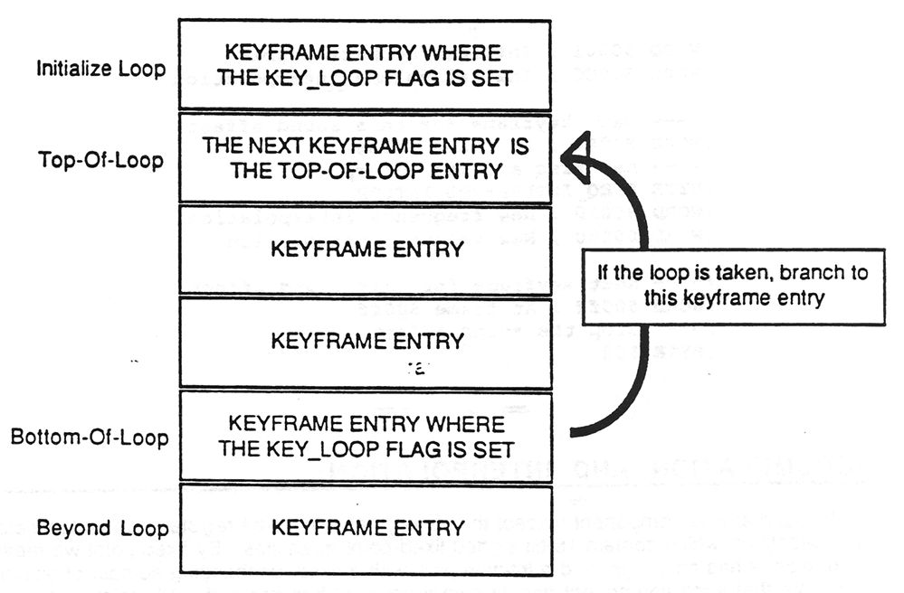

# HSFX - Handy sound effects system

This chapter describes most everything there is to know about *HSFX*, the Handy Sound Effects system. The topics covered in this chapter include the HSFX concept, tools, tables, and function calls.

But not all HSFX topics are discussed in this chapter; several of the topics are significant enough to warrant separate chapters. The HSFX editor, used to create sound effects, is described in the chapterHSFX Editor User's Guide. Also, the details of the Handy audio hardware are covered in the chapter Overview of the Handy Audio Hardware. Lastly, the *HMUSIC* (Handy Music) driver, which depends heavily on *HSFX*, is covered in the chapter "HMUSIC - The Handy Music System".

This chapter's information is presented in these sections:

- [HSFX Concept](#introduction-to-hsfx)
- [Editor](#)
- [Priority/ID Number](#priorityid-number)
- [Table Format](#data-table-format)
- [Loop Construct](#loop-construct)
- [An Example HSFX Table](#an-example-sound-effect-data-table)
- [Accumulation and Interpolation](#accumulation-and-interpolation)
- [The Driver Mechanism](#)
- [Summary of HSFX 6502 Functions](#)
- [Miscellaneous](#miscellaneous)

## Introduction to HSFX

*HSFX* - the initials stand for Handy Sound Effects - is a software system designed to provide convenient, flexible control of the Handy audio hardware. The *HSFX* system embodies many things, including the audio hardware, algorithms that make the hardware create specific sounds, a system driver that implements the audio algorithms, data tables used by the driver to create the sound effects, and an editor used to create the sound effects data tables.

A Handy sound effect is created by setting and then varying over time the 5 components of a hardware audio channel:

- the frequency (created by the Base Frequency Generator)
- the 12-bit shift value of the Wave Shape Generator
- the feedback-enable lines of the Wave Shape Generator
- the volume value of the Volume Control
- the integration flag of Wave Shape Selector

The audio channel's hardware components are controlled by the *HSFX* driver. The driver is interrupt code that is activated at uniform time intervals due to the interrupts generated by the audio timer, which is a hardware timer dedicated to driving *HSFX*. The *HSFX* driver is initialized and told what to do through the use of *HSFX* commands. While the *HSFX* driver runs as interrupt code, the *HSFX* commands are designed to be called by main-line program code. The *HSFX* command used most often is `PLAYHSFX`, which command gives the driver the address of a sound effect data table and asks the driver to "play" that sound effect. The driver plays a sound effect by executing the commands specified in the sound effect's data table.

Sound effects (and their data tables) are created using the *HSFX* editor, which is a program designed to provide the user with a real-time, easy-to-use sound playground. The *HSFX* editor lets the user manipulate a graphical representation of the audio hardware to specify what values the audio hardware should be have at a given instants of time, known as a keyframes, and how to change those settings from one instant to another. After the user has created the desired sound, the *HSFX* editor writes a file containing the data table required by the *HSFX* driver.

*HMUSIC*, the Handy music system, exists as a shell around the *HSFX* system. Like *HSFX*, *HMUSIC* consists of commands called by the main-line program and a driver that runs during interrupt . The *HMUSIC* driver plays a song by processing the commands in a song data table. The song table commands define music notes. *HMUSIC* plays each music note by converting it into an *HSFX* data table and then submitting the sound effect to the *HSFX* driver (in exactly the same way all other sound effects are submitted).

*HMUSIC* will not be discussed further in this chapter. To learn more about it, refer to the chapter """HMUSIC - The Handy Music System""".

Throughout this manual's audio system chapters the phrase audio frame is used. This refers to the system activity that takes place with each tick of the audio timer clock. With every audio frame each active component of the audio system is advanced to its next setting (e.g. you might set up an audio register's value to start at 10 and change to 30 over a span of 10 audio frames, which the driver would do for you by adding 2 to the register every audio frame). The default audio frame duration is 1/240 of a second, but the duration can be modified both at assembly time and at run time. The programmer gets final say on the audio frame duration; of course, the wise programmer always consults with the sound guys before making a decision about the audio frame rate.

Now that you know about the audio frame we can describe the life and times of a sound effect with respect to the audio frames.

The *HSFX* driver records the number of audio frames that a sound effect has been active, initializing the sound's frames-active count to zero when the sound is launched and incrementing the count every audio frame thereafter. This `frames-active` count is used to trigger the fetching of the next bunch of data from the sound effect's table.

As already mentioned, a sound effect is defined by the contents of its data table. In particular, the data table is comprised of a series of keyframe entries, with each keyframe entry being comprised of an audio frame number and audio control data.

The *HSFX* driver uses the keyframe's audio frame number to detect whether it's time to process the keyframe. This is accomplished by comparing the keyframe's frame number with the sound effect's `frames-active` count every audio frame. When the `frames-active` count reaches the keyframe's frame number, it's time to process the keyframe.

Processing a keyframe consists of copying the keyframe's data to the control registers of the audio channel assigned to the sound effect, and then advancing the keyframe pointer to the address of the next keyframe.

The *HSFX* driver uses the audio control data to create the desired sound effect. To describe this briefly: each audio channel has a number of accumulator and interpolator registers, which registers might be initialized in any given audio frame by keyframe data. The registers are manipulated every audio frame by the *HSFX* driver, which converts the accumulators into values that are written to the audio hardware registers, and then adds the interpolators into the accumulators for the next frame. This whole process is described in more detail below in the section [Accumulation and interpolation](#accumulation-and-interpolation).

In addition to a frame number and audio register values, keyframes can contain some special items that are used to define a `keyframe` loop: the `top-of-loop` and `bottom-of-loop` indicators and a `loop-count` value. A keyframe loop is series of keyframes that will be executed repeatedly. The keyframe containing the `top-of-loop` indicator defines the first in the series, and the keyframe with the `bottom-of-loop` indicator defines the last. The `loop-count` value defines how many times the loop should be executed. When the `loop-count` is exhausted, the loop is exited and the keyframe following the loop is the next one executed. Also, you can specify a `loop-count` value that will cause the sound effect to begin an `infinite` loop, that is, a loop that will never exit.

Keyframe loops are detailed below in the section [Loop construct](#loop-construct).

And then, after all the keyframes are processed, after all the loops are executed and all the data is consumed, the normal sound effect reaches its end and is removed from the system. A special keyframe entry, one that defines no data and no control constructs, is used to designated `end-of-sound-effect`. When the *HSFX* driver encounters an `end-of-sound-effect` keyframe, the driver silences the audio hardware, frees the audio channel, and erases all references to the sound effect's data table.

However, not all sound effects have an end. If you use the keyframe loop construct to define an infinite loop, the sound effect will play on until you explicitly stop it or until some audio event causes the sound to stop.

A final note: all sound effects, including the `music-note` sound effects created by *HMUSIC*, must be assigned a priority. The priority is used to define the importance of a given sound effect with respect to the others. Higher-priority sound effects will always be heard over lower-priority ones, even when it means killing a lesser one to free up a channel for the greater.

Refer to this chapter's [Priority/ID Number](#priorityid-number) section for details.

## Priority/ID Number

Each sound effect has a priority/ID number, which is used both as a unique identifier for the sound and to specify the importance of the sound with respect to the others. The programmer provides a priority/ID number for a sound when submitting the sound to be played.

Sounds that have a greater priority will always play over sounds with lesser priority. A high-priority sound will bump a lower one off of an audio channel as needed. Low-priority sounds will not disturb high-priority ones.

If there's a free audio channel when a sound effect is submitted, the channel is given to the sound effect and priority isn't considered.

But if all channels are currently in use when a request to play a sound is made, the *HSFX* driver will look through the current sounds to try to find one with a priority that's less than or equal to the the priority of the new sound. If one or more is found, the one with the lowest priority is zapped and the channel is given to the new sound. If no sound with a lower or equal priority is found, the new sound isn't played.

## Data table format

When an audio channel is newly selected to play a sound effect, the channel's *HSFX* accumulators and interpolators are preset to zero. Those registers are then modified according to the specifications in the sound effect's data table. Every audio frame the channel's accumulators are converted into data that's written to the audio hardware, thereby creating the desired sound effect.

The *HSFX* data table is made up of one or more keyframe entries. The keyframe entry There must be at least one keyframe entry in an *HSFX* table.

A keyframe entry is comprised of three parts: a frame number, followed by specification flags, and then a block of data that's variable in size coincident with the order, number and type of specification flags.

### Frame number

The keyframe entry starts with a 16-bit keyframe number. This number designates the audio frame number during which the specifications of this keyframe entry should take effect. The keyframe number of a sound effect is relative to the frame during which the sound effect started to play. If an entry has a frame number of zero, then the keyframe data will be loaded during the first frame that the sound exists (there almost always is a 
keyframe zero). Note, as described in this chapter's [Loop construct](#loop-construct) section, that the frame number is reset every time the driver takes a branch to the top of a loop.

Normally keyframe entries have ascending keyframe numbers. The only time that adjacent keyframes can have the same frame number is when the first keyframe is a loop specifier; this is described below under [HSFX Loop Construct](#loop-construct). Keyframes in ascending memory locations should never have descending frame numbers unless you want your sound to play for a really long time.

Note that restricting the number to 16 bits means that the longest a sound can live is 65536 audio frames. This shouldn't be a problem. If the audio frame time interval turns out to be 1/240 of a second, sound effects will be able to live for 273 seconds, which should be plenty.

### Specification flags

Following a keyframe's frame number comes a byte that contains the keyframe specification flags. Most of these flags, if set, cause the registers of the sound effect's audio channel to be loaded with keyframe data. Other keyframe flags are used to define the beginning and end of a loop.

If any of the specification flags is set, a corresponding value can be found among the data of this entry. The driver look sat the flag bits in order from high to low, and for each flag that's set a value will be fetched from the next sequential location of this keyframe's data block. Thus the amount of data in a keyframe entry is dependent on the number of specification flags that are set.

A keyframe that has no flags set is a special keyframe that denotes end-of-sound-effect. When the *HSFX* driver processes such a keyframe, the audio is silenced and all references to the sound effect are removed.

Here's the names and meanings of keyframe flags, listed in the correct high-to-low order:

|||
|---|---|
|KEY_LOOP|If this bit is set and we aren't already looping, then this keyframe entry includes a loop counter. If this bit is set and we are already looping, then this keyframe entry marks the end of the loop and there is no loop counter.|
|FREQ_ACCUM|If this bit is set, the entry includes a new frequency accumulator value.|
|SHIFT_ACCUM|If this bit is set, the entry includes a new shifter accumulator value.|
|FBACK_ACCUM|If this bit is set, the entry includes a new feedback-enable accumulator value.|
|VOL_ACCUM|If this bit is set, the entry includes a new volume accumulator value.|
|FREQ_INTERP|If this bit is set, the entry includes a new frequency interpolation value.|
|FBACK_INTERP|If this bit is set, the entry includes a new feedback-enable interpolation value.|
|VOL_INTERP|If this bit is set, the entry includes a new volume interpolation value.|

### Keyframe data

Following the keyframe specification flags are zero or more data values. The number and byte count of the keyframe data is defined by which specification flags are set and what data is supposed to accompany the flag. For example, if the frequency accumulator flag is set then immediately following the keyframe header will be a 16-bit frequency accumulator value. If the volume interpolation flag is set then the next thing in the table will be a 16-bit volume interpolation value, and so on.

Note that the only keyframe with zero data values is the special `end-of-sound-effect` keyframe, where all the specification flags are zero.

A 6502 note about keyframe data that's almost not worth mentioning: whenever keyframe data fields are declared as 16-bit, the data is always stored in normal 6502 low byte/high byte fashion, of course.

## Loop construct

There are 4 keyframes associated with a loop: the keyframe where the loop is initiated, a keyframe that acts as the `top-of-loop`, a keyframe that defines the `bottom-of-loop`, and the keyframe that's executed when you fall out of the bottom of a loop.



The loop counter is initialized with the HSFX table value in the keyframe where the loop flag is set. The following keyframe is the top-of-loop keyframe. When the end of a loop is reached and the loop condition succeeds, the top-of-frame keyframe is the next keyframe executed. The top-of- frame keyframe is executed immediately, not during the following frame. When the loop condition finally fails the keyframe following the end-of-loop keyframe is executed immediately. It would be valid for this keyframe to be another top-of-loop specifier.

If the loop counter that comes from the *HSFX* table should be zero this is a request for an infinite loop, which *HSFX* merrily provides for you.

When you take a loop branch, the frame number of the top-of-loop keyframe becomes the current frame number for this sound effect, and then the frame number will ascend from there as usual.

When the loop is taken, the frame number of the sound effect is set to the frame number of the top-of-loop keyframe.

## An example sound effect data table

```
SampleSFX

	;---- Next keyframe for this sound effect 
	.WORD $0000 ; At frame $0000
	;---- new freq/shift/fback accum and vol interp
	.BYTE FREQ_ACCUM+SHIFT_ACCUM+FBACK_ACCUM+VOL_INTERP
	.WORD $2222 ; Initial frequency
	.WORD $FFFF ; Initial shifter
	.WORD $0001 ; Initial feedback-enable
	.WORD $00CC ; Initial volume interpolation

	;---- Next keyframe for this sound effect
	.WORD $0064 ; At frame $0064
	;---- new freq and vol interp
	.BYTE FREQ_INTERP+VOL_INTERP
	.WORD $0010 ; New frequency interpolation
	.WORD $0000 ; New volume interpolation

	;---- Next keyframe for this sound effect
	.WORD $00ff ; At frame $00ff
	;---- Stop the sound effect
	.BYTE $00
```

## Accumulation and interpolation

Each sound effects component (except the shifter) has two 16-bit registers, an accumulator and an interpolator, which contain 16-bit signed fixed-point quantities. By fixed point we mean that each register has an integer and a fraction part, with a fixed, unchanging number of bits in each part; note that each component has its own number of bits per part. All registers are signed, allowing interpolations to be either positive or negative.

With each audio frame, the accumulators are translated into values that are stored in the audio hardware registers. Then, if we're at a keyframe, all new accumulator and interpolator values are fetched from the table and stored in the appropriate registers. Finally the interpolation values are added into the accumulators.

The shifter component is a special case. There is no shifter interpolation register, nor is there a shifter accumulator. Whenever a shifter value is encountered in an HSFX table the value is written directly to the hardware.

The translation of the accumulators into hardware values is different for each component. Here's the rules for the various translations:

`FREQUENCY`  
This register has 14 bits of significant information, where the 8 most significant bits of the 14 are translated into a base frequency selection and the integer multiplier of the selected base frequency. The frequency accumulator's other 2 bits are used for sign and 1 bit of fraction. Before translations are performed, the value should be shifted right one place to truncate the fraction. After that, the translation of the top 6 bits can work like this:

- If bit 5 ($20) is set select the 64 usec frequency
- Else if bit 4 ($10) is set select the 32 usec frequency
- Else if bit 3 ($08) is set select the 16 usec frequency
- Else if bit 2 ($04) is set select the 8 usec frequency
- Else if bit 1 ($02) is set select the 4 usec frequency
- Else if bit 0 ($01) is set select the 2 usec frequency
- Else if all of the top 6 bits are zero, select the 1 usec frequency

The 8 most significant bits are used as the multiplier. Note that in the case where none of the high 6 bits is set, the 1 usec clock is selected and the lower byte, whatever its value, is used as the multiplier.

`FEEDBACK-ENABLE`  
This accumulator has 1 bit of sign, 8 bits of significant information and 6 bits of fraction. Some fancy dancing is done to get the correct bits of this accumulator out to the hardware.

`VOLUME`  
This accumulator has 8 bits of significant information (including a sign bit) and 8 bits of fraction. Simply write the high byte to the hardware register and ignore the low byte.

`SHIFTER`  
The 12-bit shifter value is written directly to the Handy audio hardware. There is no accumulator or interpolation register.

## Summary of the HSFX commands

This section is seriously preliminary. We need to decide what we really want the arguments to and results from these functions to be.

`StartHSFX`  
You call this routine with the low-byte of an *HSFX* table in the accumulator, the high-byte of the table in the X register, and the sound's priority in the Y register.

Presumably this routine will typically be called by a routine named something like `PlaySoundEffect` which will want the index number of the sound effect in the accumulator and which loads up the registers accordingly before calling `StartHSFX`.

If the sound is started, the channel number is returned in the accumulator in case you have some need for it. If the sound wasn't started, a `-1` is returned.

`StopHSFX`  
This routine allows the programmer to stop a sound effect if it's still running. The logic of this routine is unfortunately a bit slippery. The argument that you supply to this routine is a priority number for the sound effect you want to stop (thereby forcing the priority number to act as an ID number). The *HSFX* driver will look for a sound effect that has that priority and if one is found then it is stopped.

If the programmer has created more than one sound effect with the same priority/ID number then the found one found will be the one stopped.

`AllocAudio`  
This routine tries to allocate an audio channel for the caller's exclusive use. You provide a priority number and if any channel is available at that priority then you'll get it (see the section **Priority/ID Number** above for more details). When calling this routine set the accumulator to the priority of your desire for a channel. If you successfully get a channel, the system will not disturb it until you call `FreeAudio`.

There's a definition, `HFSX_BIGPRIORITY`, which will get you a channel if there's one to get. However, note that even if you use a priority of `HFSX_BIGPRIORITY` this routine can fail nevertheless if all of the channels have already been allocated away from *HSFX*. If you don't want to mess around, you just want the gol-darned channel, then use the `GrabAudio` routine.

If a channel is allocated, the channel number is returned in the accumulator. If no channels are currently available, a `-1` is returned.

`GrabAudio`  
This routine forces the *HSFX* driver to stop using the audio channel specified in the accumulator.

Once you have grabbed a channel, the system will not disturb it until you call `FreeAudio`.

`FreeAudio`  
If you have allocated or grabbed an audio channel away from *HSFX* and you want to allow *HSFX* to use the channel again, call `FreeAudio` with the channel number in the accumulator.

If you call this routine with an invalid channel number (like `-1` for instance) nothing bad happens, promise.

## Miscellaneous

You can turn off all sound effects like this:

```
		PHP ; Don't have to do this if you're in interrupt code
		SEI : Don't have to do this if you're in interrupt code
		LDA 	#3
		STA 	temp
.10 	JSR
		GrabAudio
		JSR FreeAudio
		DEC temp
		LDA temp
		BPL .10
		PLP ; Don't have to do this if you're in interrupt code
```
