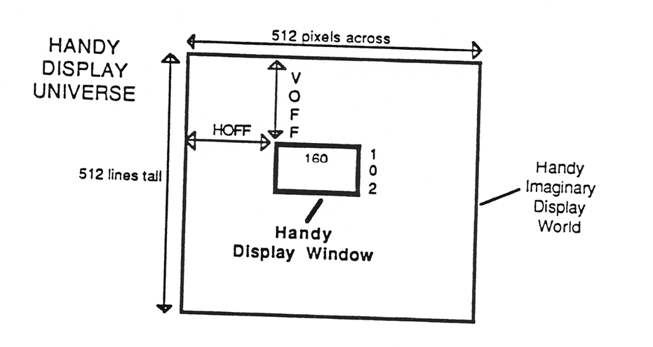
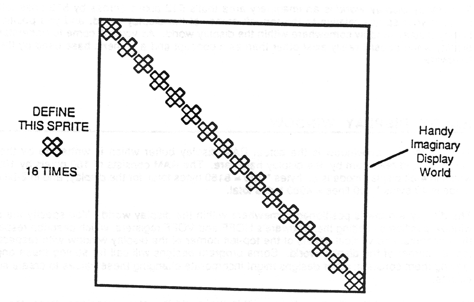
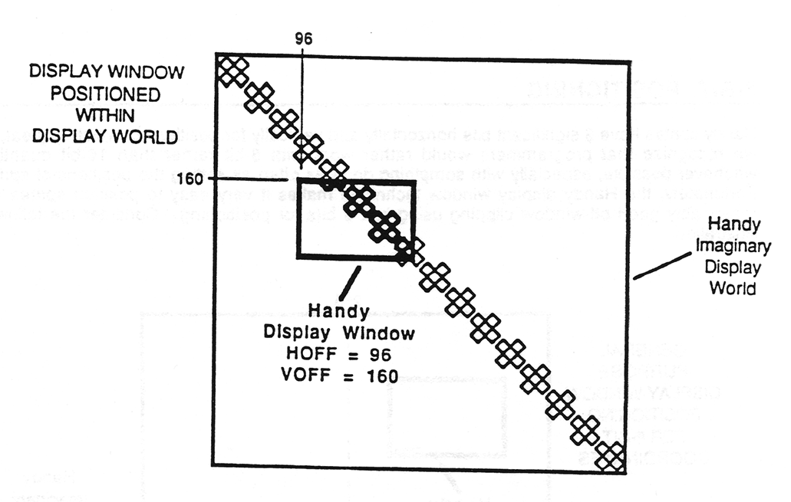
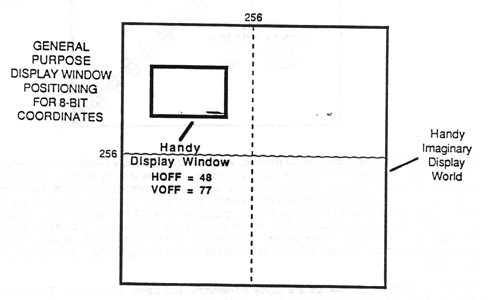
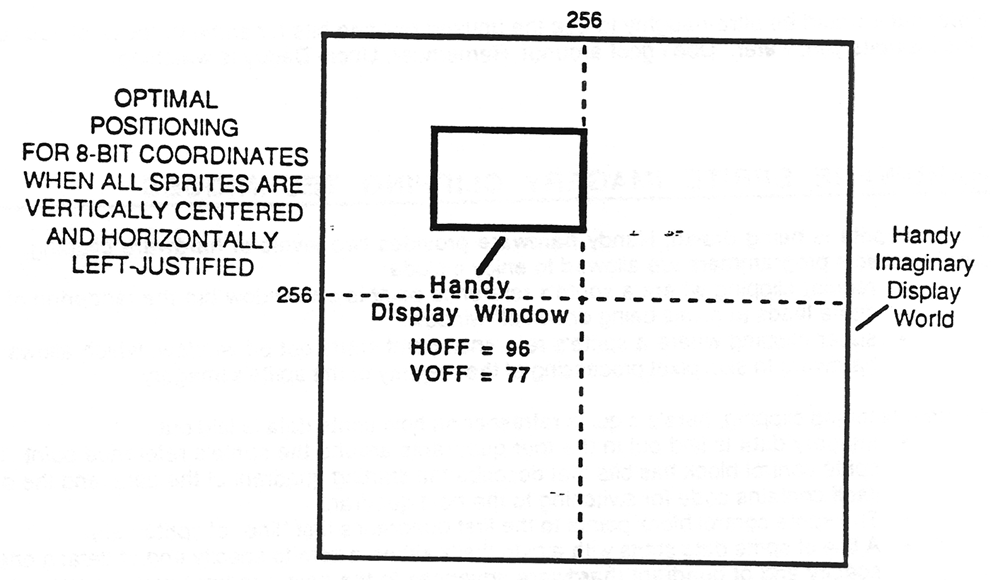
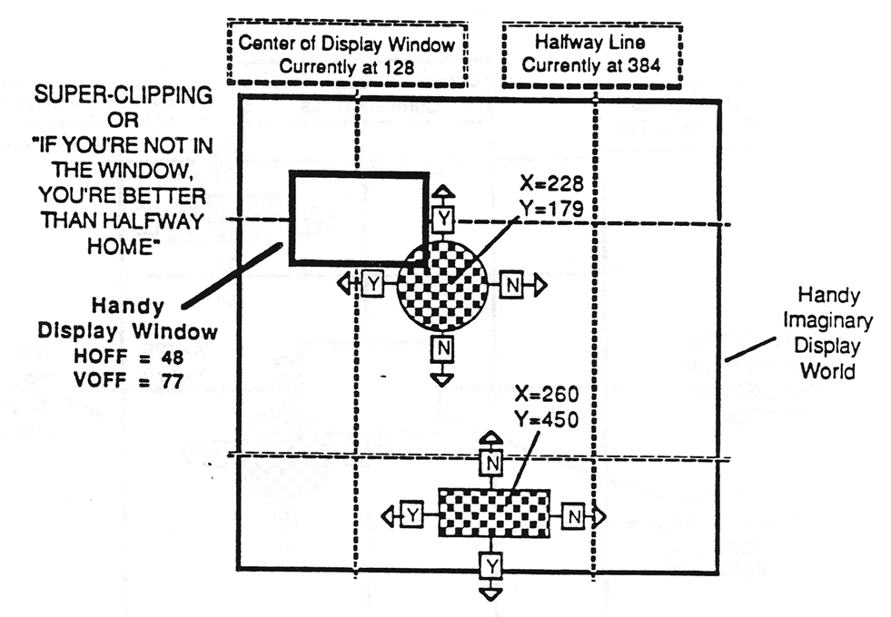
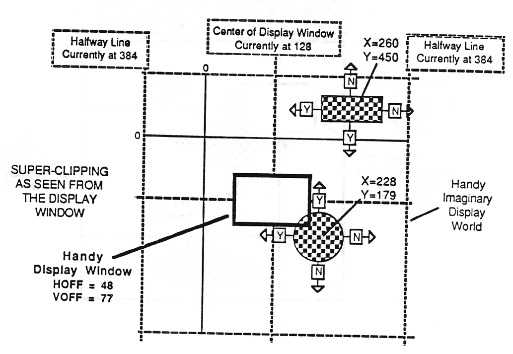

# Positioning of the HANDY display and sprites

This section describes Handy display and sprite positioning. It contains the following sections:

- [Introduction](#introduction)
- [Handy Imaginary Display World](#handy-imaginary-display-world)
- [Handy Display Window](#handy-display-window)
- [Sprite Positioning in the World and the Window](#sprite-positioning-in-the-world-and-the-window)
- [8-Bit Positioning](#8-bit-positioning)
- [16-Bit Positioning](#16-bit-positioning)
- [Hardware Sprite Imagery Clipping Techniques](#hardware-sprite-imagery-clipping-techniques)

## Introduction

The Handy display map and sprite positioning is designed to be both convenient to use if you want to do simple sprite positioning and powerful to use if you want to let the hardware do its several flavors of clipping for you. To understand how it works, you have to know about the Handy display world and the Handy display window.

## Handy Imaginary Display World

The Handy display world is an imaginary area that's 512 pixels across by 512 lines tall. You position your sprites relative to the top-left corner of the display world, and you position your Handy display window somewhere within the display world. As you will come to understand, the display worid doesn't really exist other than as a concept and a numeric base used by the sprite hardware.

## HANDY display window

The Handy display window is the actual RAM display buffer which is written to by the sprite hardware and read from by the display hardware. The RAM consists of 160 pixels by 102 lines, which in 4-bit display mode is `80` bytes * `120` = `8160` bytes total for the display, and in 2-bit display mode is `40` bytes * `120` lines = `4080` bytes total.

The display window is positioned somewhere within the display world. You specify the display window position by setting the hardware's `HOFF` and `VOFF` registers, which describe respectively the horizontal and vertical offsets of the top-left corner of the display window with respect to the top-left corner of the display world. Some program designs will call for setting these once and leaving them constant; other designs might incorporate changing these values to create scrolling effects.

The positioning of the display window within the world is just an imaginary thing; the display window is RAM, but the rest of the display world is just numbers used by the hardware to effect efficient clipping logic.

When you ask for your sprites to be rendered, only the sprites that appear within display window will actually be rendered.

## Sprite positioning in the world and the window

Sprites are defined relative to the top-left corner of the display world. When a sprite's reference point is the coordinate `(0,0)` then the sprite is located in the top-left corner of the world. A coordinate of `(511,511)` locates a sprite at the bottom-right corner of the world. In order to be able to position sprites anywhere from 0 to 511, we need 9 bits for both vertical and horizontal positioning. In fact, there are 16 bits for positioning on each axis, with the upper 7 bits currently ignored by the system though they should be initialized appropriately as described under [16-Bit Positioning](#16-bit-positioning) below.

Let's look at a positioning example. Imagine that we have the X sprite shown in the above illustration, which sprite is 32 pixels wide and tall, and we want to define 16 of these along a diagonal. We define the sprite locations relative to the top-left of the display world, putting the first sprite at `(0,0)`, the second at `(32,32)`, and so on. Note that so far we're just talking about positioning the sprites, not displaying them. How the sprites are actually displayed depends on the position of your display window.

To display some of the sprites we've defined, we position the display window somewhere in the display world. The positioning of the display window within the display world is independent of the positioning of our sprites within the display world. In the above illustration, the window is located with a horizontal offset of 96 and a vertical offset of 160 from the top-left of the display world. The window covers the display world coordinates from `(96,160)` to `(255,261)`. Four of our sprites appear in the display window, the ones with the coordinates `(128,128)`, `(160,160)`, `(192,192)` and `(224,224)`. When we ask to have our sprites rendered, those 4 sprites will be drawn into the display window RAM while the other 12 will be clipped by the hardware and not drawn at all.

Notice that some of our sprites are partly on-window and partly off-window. The off-window imagery of these sprites is automatically clipped by the hardware and not rendered. "Whew!" sigh the programmers who know how much work they just got out of. This means that you can make sprites slide off-window just by positioning them and letting the hardware do the work. The hardware does even fancier clipping, which is described below in the section [Hardware Sprite Imagery Clipping Techniques](#hardware-sprite-imagery-clipping-techniques).

There are two techniques you can use for positioning a sprite, which techniques can be intermixed in the same display without restriction. The techniques are described in the two following sections, and include:

- Simple 8-bit positioning of sprites, which provides a reasonable amount of clipping around the edges of the display window
- Full 16-bit (9 significant bits) positioning of sprites, which carries the cost of doing two-byte math and move operations rather than one-byte when positioning sprites but which gives the ability to move very large objects off-window

By the way, if you define an entire display world full of sprites, you could show all the sprites simply by panning the display window around within the world. None of the sprite definitions would need to be changed to do this. You need only change `HOFF` and `VOFF` to move the window.

## 8-bit Positioning

Handy sprites have 9 significant bits horizontally and vertically for positioning, which is great, but we recognize that programmers would rather work with 8-bit rather than 16-bit quantities whenever possible, especially with something done as often as setting the positions of sprites. Fortunately, the Handy display window technique makes it very easy to position sprites with reasonably good off-window clipping using just 8 bits for positioning. Consider the following illustration.

The above illustration shows one of the niftiest capabilities of the display window scheme. Notice that the display window is centered in the 8-bit neighborhood of the display world. When you set up your window in this way , you can position your sprites using only 8 bits of position and still get a good amount of hardware clipping around the edges of the window. Sprites as much as 48 pixels wide and 77 lines tall in any direction from the sprite's reference point can be positioned completely off-window (except for the very last pixel; when that one goes, get rid of the sprite!). Sprites that you want to move off-window and that are centered about the reference point can be as wide as 96 pixels and as tall as 154 lines tall. This is the most general purpose positioning of the display window within the display world when using 8-bit coordinates, and, unless you have some extraordinary needs for your sprites, this is probably the display window configuration you'll use.

On the other hand, if you have sprites that need to have dimensions that are wider than 48 pixels from the reference point or taller than 77 from the reference point, you might choose to position the display window other than as shown above. For instance, if all sprites that must move off- window left or right are defined with the reference point along the left edge of the imagery, and you set the display window to its rightmost position in the 8-bit neighborhood, then the sprites could be as wide as 96 pixels wide and still be clipped left and right. The following illustration shows the desired position of the display window when you have sprites that are all centered about the reference point vertically and that all have the horizontal reference point at the left edge of the imagery.

Note that with either technique, in fact with any of the ways you might try to position the display window in 8-bit coordinate mode, you are restricted to a maximum sprite width of 96 pixels and height of 154 pixels if you want to be able to slide the sprite off-window. And the widest margin defines the greatest width you can have from reference point to edge, while the thinnest margin defines the maximum width you can have from the reference point to the other edge. For example, if you use an `HOFF` of 10, there will be 10 pixels of margin on the left and 86 pixels on the right, which means that your sprites could be up to 86 pixels from reference point to left edge of the imagery but at most 10 pixels from reference point to the right edge. All of this goes for height too. Confusing enough for you? If so, then stop reading and get back to work!

Remember that though you may be using only 8 of the 16 position bits of each axis, nevertheless all 16 bits are still used by the hardware so you must initialize the upper 8 bits to zero.

## 16-bit Positioning

If you are going to use all 9 significant bits when positioning your sprites, you should, for the sake of upward compatibility with future versions of the hardware, make sure that you write complete 16-bit values to the position fields of your sprite control block.

If you want to give your sprite a negative coordinate then you should set all the high bits of the high byte of the position register. On the other hand, if it's your intention to position your sprite at a large positive coordinate (large being greater than `255`) you currently can go as high as `511`, which is the limit of the current hardware, and which includes setting the 0th bit of the upper position byte. To specify that you want a large positive number, you must clear the all the other bits of the high position byte. Today the distinction doesn't matter, but with tomorrow's new 10-bit position hardware you'll be glad you followed these rules because - surprise! - your software still works, although of course it will probably break for some other thing that the hardware guys forgot to tell us about, the jerks.

Note that it would be ultra-naughty to use the unused position bits for some purpose of your own. This includes you, Peter. Don't goof around! Remember, Uncle Daddy is watching.

## Hardware sprite imagery clipping techniques

When a sprite is being drawn, Handy hardware provides two levels of hardware clipping. The clipping effects programmers are allowed to enjoy include:

- Regular clipping where a sprite's reference point is on-window but the rendering of the sprite leads to pixels being drawn off-window
- Super-clipping where a sprite's reference point starts out off-window, which allows the hardware to skip pixel processing of the majority of the sprite's imagery

Before describing clipping, here's a quick refresher on how sprite data is laid out:

- Imagery data is laid out in the four quadrants around the sprite's reference point The sprite control block has bits that describe the starting quadrant of the data, and the data itself contains code for switching to the next quadrant.
- The sprite control block points to the first quadrant's first "line" of sprite data.
- A line of sprite data starts with a byte that's either: a zero to specify end of data; a one to specify end of quadrant (hardware advances to the next quadrant counter-clockwise); or some other value which specifies the byte offset to the start of the next line of data.

Regular clipping is easy to understand. When a given line of a sprite is being rendered, as soon as one of the pixels falls off-window the hardware stops processing the line and skips ahead to the start of the next line. As soon as one of the lines is going to be rendered off-window, the hardware skips ahead through the rest of the lines looking for the next start of a quadrant (or end of data, of course).

But wait, there's more. Introducing super-clipping, complete with overly elaborate illustrations.

If the sprite's reference point falls outside the display window, the sprite engine hardware does super-clipping. Here's how it works:

- Imagine a line halfway around the display world from the center of the display window. Call this the "halfway line".
- With each quadrant being rendered, a test is made at the start of each scan line to be rendered with respect to the halfway line on each axis.
- If the direction of drawing in that quadrant is toward the halfway line on either axis, which is to say away from the display window on that axis, then the imagery couldn't possibly appear in the display window so the scan lines are not processed and instead are used only to find the start of the next quadrant. This is super-clipping.
- Consider the `CIRCLE` sprite in the above illustration. From the sprite's reference point, left and up are toward the display window (these axes are marked with `Y` for Yes) and right and down are away from the display window (marked `N` for No). When either axis votes No, the quadrant is super-clipped. This means that only the double-Yes quadrant's pixel data will be processed, which means further that when a sprite's reference point is off-window three of its four quadrants will be super-clipped!

If a quadrant is super-clipped, the sprite machine doesn't read any of the pixel data and instead skips along madly a scan line at a time to the next quadrant to be processed. The net effect is a great time savings.

Super-clipping takes place in an environment that's centered around the display window, so to make super-clipping clear our display world/window model used throughout this document needs to be rendered differently, more egotistically. Consider the `RECTANGLE` sprite in the above illustration. Logic might dictate that the upper-left quadrant of the sprite should be the only one not super-clipped, as it seems that that's the only quadrant pointed toward the display window. But in fact the lower-left quadrant is the only one not super-clipped. The reason why is best illuminated by the following alternative view of the Handy universe.

Note that in this scheme, sprites with negative coordinates may still be rendered in the display window. Whether or not 9-bit sprites will be rendered correctly still needs to be worked out. Suffice it to say for now that things will work correctly unless of course they don't.
